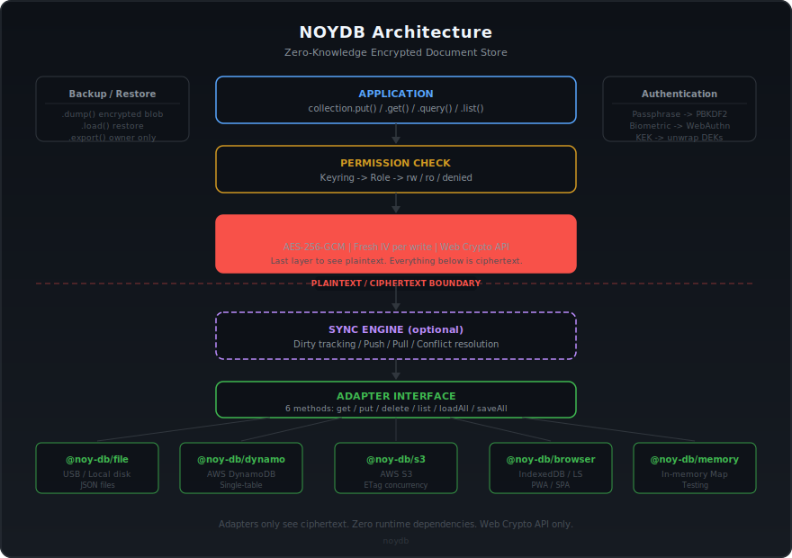

<div align="center">


# noy-db

## None Of Your DataBase
<sub><em>(formerly shortened as: "None Of Your <strong>Damn Business</strong>")</em></sub>

**Your data. Your device. Your keys. Nobody else's server.**

An encrypted, offline-first, **serverless** document store. The library lives inside your app, stores in whatever backend you choose, and nobody in the middle ever sees plaintext — not the cloud provider, not the sysadmin, not the database vendor. Not noy-db either.

[](https://www.npmjs.com/package/@noy-db/core)
[](LICENSE)
[](https://nodejs.org)
[](https://www.typescriptlang.org)
[](#zero-dependencies)
[](#encryption)

</div>

---

## Why noy-db exists

Most data-storage tools assume you'll rent a database from somebody. noy-db assumes the opposite: **your data belongs on your devices**, not in somebody's cloud.

Every design choice in this project is built around that inversion. The default mode is **offline**. The default trust boundary is **your own process**. The default backend is **a file you control**. Sync, multi-user access, cloud storage — those are optional capabilities you layer on when you need them, not baseline assumptions you can't escape.

If a breach happens at your cloud provider, the attacker gets ciphertext. If a sysadmin reads the DynamoDB table, they see ciphertext. If you lose the USB stick, whoever finds it sees ciphertext. Encryption happens before the data leaves the library — there's no "encrypted in transit" layer you're supposed to trust. The keys stay in your process memory and are derived from a passphrase that nothing in the system ever stores.

**Data ownership isn't a feature we shipped. It's the shape of the whole project.**

---

## Key factors

- **🔒 Zero-knowledge encryption** — AES-256-GCM with per-user keys. Every adapter (file, DynamoDB, S3, browser storage) only ever sees ciphertext. Lose the USB stick, breach the cloud, subpoena the provider — none of them can read your records.
- **☁️ Serverless by design** — there's **no noy-db server to run**. No Docker image, no managed service, no backend to keep alive. The library is a ~30 KB TypeScript package that embeds directly in your app. You pick the storage backend; you own the data end-to-end. If you shut your computer off, the database is off. If you open your app, the database is on.
- **📱 Runs on any OS, any device** — macOS, Linux, Windows, iOS, Android, Raspberry Pi, an old laptop, a shared browser tab. Any JavaScript runtime (Node 18+, Bun, Deno, every modern browser). **Minimum requirements: a JS engine and the Web Crypto API.** That's it. No GPU, no heavy dependencies, no system-level service.
- **🌐 Offline-first** — every operation works without internet. Sync to a remote is opportunistic, not mandatory. The library doesn't distinguish between "I'm online" and "I'm offline" — both modes use the same code path.
- **👥 Multi-user built in** — 5 role types (owner / admin / operator / viewer / client), per-collection permissions, portable keyrings, key rotation on revoke. **No auth server required** — the keyring file travels with your data and lives on the same backend.

---

## Runs on whatever you've got

| Platform | Runtime | Storage backend | Status |
|---|---|---|---|
| 🖥️ **Desktop** — macOS / Linux / Windows | Node 18+, Bun, Deno | `@noy-db/file` (JSON on disk) | ✅ |
| 📱 **Mobile browser** — iOS Safari 14+, Android Chrome 90+ | Browser JS | `@noy-db/browser` (IndexedDB / localStorage) | ✅ |
| 🌐 **Desktop browser** — Chrome, Firefox, Safari, Edge | Browser JS | `@noy-db/browser` | ✅ |
| ⚡ **PWA / offline web app** | Service Worker + browser | `@noy-db/browser` | ✅ |
| 🖧 **Server (headless)** | Node 18+ | `@noy-db/file`, `@noy-db/dynamo`, `@noy-db/s3` | ✅ |
| 💾 **USB stick / removable disk** | Any OS + any runtime | `@noy-db/file` | ✅ |
| 🔌 **Electron / Tauri desktop app** | Desktop shell | `@noy-db/file` or `@noy-db/browser` | ✅ |
| 🧪 **Testing / CI** | Any JS runtime | `@noy-db/memory` (no persistence) | ✅ |

**No database server to install. No Docker. No Docker Compose. No managed service bill.** The entire storage layer runs inside your app process. Hardware-wise, anything that can run a modern browser can run noy-db — including phones, tablets, Raspberry Pi, and low-end cloud VMs.

---

## International project, Thailand focus

noy-db is an international open-source project, developed and maintained from **Thailand**. The first production consumer is a regional accounting firm in Chiang Mai — the library's design assumptions (offline-first, multi-user, sensitive financial data, per-tenant isolation, USB-based workflows for poor connectivity) come directly from that real-world deployment.

Thai language and regional format support is a first-class concern, not an afterthought:

- **Thai text handling** — Unicode throughout. Record IDs, field values, user display names, error messages, and backup files all round-trip Thai characters cleanly (including combining marks and the full BE character set). Verified in the test suite.
- **Regional formats** — Buddhist Era dates (`พ.ศ. 2568`), Thai numerals (`๐ ๑ ๒ ๓`), and THB currency formatting flow through the standard `Intl` APIs — no special-case code, works in both Node and browser environments.
- **Thai prompts in the scaffolder** — the `npm create @noy-db` wizard is planned to ship in both English and Thai, auto-detecting from `LANG` / `LC_ALL` (tracked in issue [#36](https://github.com/vLannaAi/noy-db/issues/36), scheduled for a future release).
- **Timezones** — ISO-8601 with explicit offsets everywhere. `Asia/Bangkok` is never hardcoded but is the default assumption for the reference demos.

International contributors and users are welcome. Open an issue or PR in whatever language you're comfortable with — English, Thai (ไทย), or anything else — and we'll work with it. The code and API stay in English (for consistency with the JavaScript ecosystem), but docs, examples, and issues can use either language.

---

## The Problem noy-db solves

You have a small, sensitive dataset (1K–50K records). It needs to work **offline**, sync to the cloud when available, be **encrypted at rest** on every backend, and support **multiple users with different access levels**. You want to **swap storage backends** without changing your app code. And you don't want to stand up, pay for, or trust a database server to do any of this.

**No existing library does all of this.** noy-db does.

| Library | What's Missing |
|---------|---------------|
| RxDB | Encryption is a paid plugin. No file backend. |
| Amplify DataStore | Mandatory AppSync. No zero-knowledge encryption. |
| PouchDB | CouchDB only. No DynamoDB. Aging project. |
| TinyBase | No encryption. No DynamoDB. |
| LowDB | No sync. No encryption. No multi-user. |
| Dexie | Browser only. No server-side. |
| Replicache | BSL license (paid). Browser only. |

None of these run fully serverless AND zero-knowledge AND multi-user AND offline-first AND across every JS runtime. That combination is the point.

---

## Architecture

<picture>
  
</picture>

> Adapters **only see ciphertext**. Encryption happens in core before data reaches any backend. A DynamoDB admin, an S3 bucket owner, someone who finds the USB stick — they all see encrypted blobs.

---

## Encryption

<picture>
  
</picture>

| Layer | Algorithm | Purpose |
|-------|-----------|---------|
| Key derivation | PBKDF2-SHA256 (600K iterations) | Passphrase to KEK |
| Key wrapping | AES-KW (RFC 3394) | KEK wraps/unwraps DEKs |
| Data encryption | AES-256-GCM | DEK encrypts records |
| IV generation | CSPRNG | Fresh 12-byte IV per write |

**Zero crypto dependencies.** Everything uses the Web Crypto API (`crypto.subtle`), built into Node.js 18+ and modern browsers.

---

## Record Format

<picture>
  
</picture>

Every record on disk, DynamoDB, or S3 is an encrypted envelope. Metadata (`_v`, `_ts`) stays plaintext so the sync engine can work without encryption keys.

---

## Deployment Profiles

<picture>
  
</picture>

### Install

```bash
# Nuxt 4 + Pinia (recommended — the v0.3 happy path)
pnpm add @noy-db/nuxt @noy-db/pinia @noy-db/core @noy-db/browser @pinia/nuxt pinia

# Plain Vue 3 + Pinia (no Nuxt)
pnpm add @noy-db/pinia @noy-db/core @noy-db/browser pinia vue

# USB / Local disk only
pnpm add @noy-db/core @noy-db/file

# Cloud only (DynamoDB)
pnpm add @noy-db/core @noy-db/dynamo

# Offline-first with cloud sync
pnpm add @noy-db/core @noy-db/file @noy-db/dynamo

# Development / testing
pnpm add @noy-db/core @noy-db/memory
```

---

## Quick Start — Nuxt 4 + Pinia (two minutes)

The v0.3 happy path is one config block, one store file, one component. Everything below is encrypted with AES-256-GCM before it touches localStorage / IndexedDB.

```ts
// nuxt.config.ts
export default defineNuxtConfig({
  modules: ['@pinia/nuxt', '@noy-db/nuxt'],
  noydb: {
    adapter: 'browser',
    pinia: true,
    devtools: true,
  },
})
```

```ts
// app/stores/invoices.ts — defineNoydbStore is auto-imported
export interface Invoice {
  id: string
  client: string
  amount: number
  status: 'draft' | 'open' | 'paid'
}

export const useInvoices = defineNoydbStore<Invoice>('invoices', {
  compartment: 'demo-co',
})
```

```vue
<!-- app/pages/invoices.vue -->
<script setup lang="ts">
const invoices = useInvoices()
await invoices.$ready

const drafts = invoices.query()
  .where('status', '==', 'draft')
  .live()
</script>

<template>
  <ul>
    <li v-for="inv in drafts" :key="inv.id">
      {{ inv.client }} — {{ inv.amount }}
    </li>
  </ul>
</template>
```

That's the whole app. Reactive Pinia store, encrypted storage, SSR-safe. See [`docs/getting-started.md`](docs/getting-started.md) for the complete walkthrough and the [`playground/nuxt/`](playground/nuxt/) demo for a runnable reference.

### Lower-level API (no Vue/Pinia)

For CLIs, tests, or backends, use `@noy-db/core` directly:

```ts
import { createNoydb } from '@noy-db/core'
import { jsonFile } from '@noy-db/file'

const db = await createNoydb({
  adapter: jsonFile({ dir: './data' }),
  user: 'owner-01',
  secret: 'my-passphrase',
})

const company = await db.openCompartment('C101')
const invoices = company.collection<Invoice>('invoices')

await invoices.put('inv-001', { amount: 5000, status: 'draft' })
const inv = await invoices.get('inv-001')
const drafts = invoices.query().where('status', '==', 'draft').toArray()

const backup = await company.dump()   // ciphertext, safe to transport
db.close()                            // clears KEK/DEK from memory
```

### With Cloud Sync

```ts
import { dynamo } from '@noy-db/dynamo'

const db = await createNoydb({
  adapter: jsonFile({ dir: './data' }),       // primary (local)
  sync: dynamo({ table: 'myapp-prod' }),      // secondary (cloud)
  user: 'owner-01',
  secret: 'my-passphrase',
  autoSync: true,
  syncInterval: 30_000,
})

// Works offline. Syncs when online.
await db.push()   // send local changes to cloud
await db.pull()   // fetch cloud changes to local
await db.sync()   // pull then push
```

### Multi-User Access

```ts
// Grant access (owner/admin only)
await db.grant('C101', {
  userId: 'operator-somchai',
  displayName: 'Somchai',
  role: 'operator',
  passphrase: 'temporary-passphrase',
  permissions: { invoices: 'rw', disbursements: 'rw' },
})

// Revoke with key rotation (old keyring becomes useless)
await db.revoke('C101', {
  userId: 'operator-somchai',
  rotateKeys: true,
})
```

---

## Roles & Permissions

| Role | Read | Write | Grant | Revoke | Export |
|------|:----:|:-----:|:-----:|:------:|:------:|
| **owner** | all | all | all roles | all | yes |
| **admin** | all | all | operator, viewer, client | same | yes |
| **operator** | granted collections | granted collections | — | — | — |
| **viewer** | all | — | — | — | — |
| **client** | granted collections | — | — | — | — |

---

<a name="zero-dependencies"></a>
## Zero Dependencies

```
┌────────────────────┬──────────────┬───────────────────────────────────────┐
│ Package            │ Runtime deps │ Peer deps                             │
├────────────────────┼──────────────┼───────────────────────────────────────┤
│ @noy-db/core       │ 0            │ —                                     │
│ @noy-db/file       │ 0            │ @noy-db/core                          │
│ @noy-db/dynamo     │ 0            │ @noy-db/core, @aws-sdk/*              │
│ @noy-db/s3         │ 0            │ @noy-db/core, @aws-sdk/*              │
│ @noy-db/browser    │ 0            │ @noy-db/core                          │
│ @noy-db/memory     │ 0            │ @noy-db/core                          │
│ @noy-db/vue        │ 0            │ @noy-db/core, vue                     │
│ @noy-db/pinia      │ 0            │ @noy-db/core, pinia, vue              │
│ @noy-db/nuxt       │ 0            │ @noy-db/core, @noy-db/pinia, nuxt ^4  │
└────────────────────┴──────────────┴───────────────────────────────────────┘
```

Every package has **zero runtime dependencies**. AWS SDKs and Vue are peer dependencies — your app already has them.

---

## Performance

| Operation | Target |
|-----------|--------|
| Open + decrypt 1,000 records | < 500ms |
| Single `put` (encrypt + write) | < 5ms |
| Single `get` (read + decrypt) | < 2ms |
| `list` / `query` 1,000 records | < 1ms |
| Key rotation (1,000 records) | < 1s |
| PBKDF2 derivation | ~200ms |

---

## Custom Adapters

The adapter interface is 6 methods. Anything that can store a blob works with NOYDB:

```ts
import { defineAdapter } from '@noy-db/core'

export const myAdapter = defineAdapter((options) => ({
  name: 'my-backend',
  async get(compartment, collection, id) { /* ... */ },
  async put(compartment, collection, id, envelope, expectedVersion) { /* ... */ },
  async delete(compartment, collection, id) { /* ... */ },
  async list(compartment, collection) { /* ... */ },
  async loadAll(compartment) { /* ... */ },
  async saveAll(compartment, data) { /* ... */ },
}))
```

---

## Status

**v0.5.0 shipped on npm.** All 10 `@noy-db/*` packages are unified on the `0.5.0` line. See the [Roadmap](ROADMAP.md) for the full plan.

| Version | Status   | Scope                                                              |
|---------|----------|--------------------------------------------------------------------|
| 0.1     | shipped  | Core MVP, multi-user, file + memory adapters, 5-role ACL           |
| 0.2     | shipped  | Sync engine, DynamoDB/S3/browser adapters, WebAuthn, Vue composables |
| 0.3     | shipped  | Nuxt 4 module, Pinia integration, query DSL, indexes, lazy hydration |
| 0.3.1   | shipped  | `@noy-db/create` scaffolder + `noy-db` CLI                          |
| 0.4     | shipped  | Schema validation, hash-chained ledger, delta history, FK refs, verifiable backups |
| 0.4.1   | shipped  | Peer dep pinning fix; unified `@noy-db/*` on a single version line  |
| 0.5     | shipped  | Core enhancements + scaffolder polish — `exportStream`/`exportJSON`, admin-grants-admin, cross-compartment queries, wizard Thai i18n + augment mode + CLI subcommands |
| 0.6+    | planned  | Query DSL completion (joins, aggregations), identity & sessions, ledger devtools |

---

## License

[MIT](LICENSE)

---

<div align="center">
  <sub>Your data. Your device. Your keys. <b>None Of Your DataBase.</b></sub>
  <br>
  <sub><em>(Originally, and still occasionally: "None Of Your <strong>Damn Business</strong>".)</em></sub>
</div>
