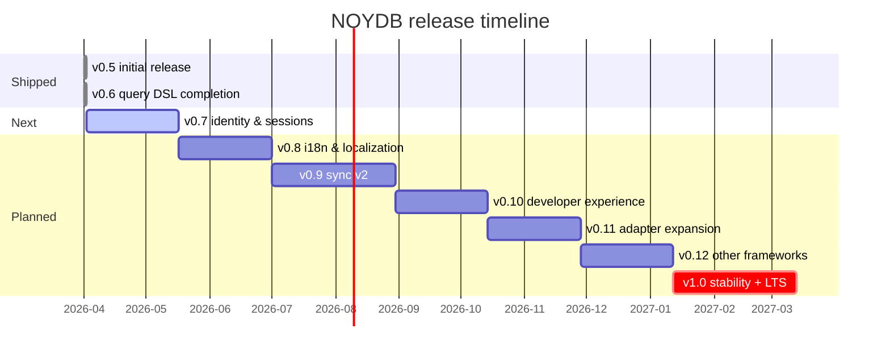

# Roadmap

> **Current:** v0.6.0 on npm — all 10 `@noy-db/*` packages unified on a single version line. Everything from v0.5 plus the completed query DSL (joins, aggregations, streaming scan) and the `.noydb` container format. **Next:** v0.7 — Identity & sessions.
>
> Related docs:
> - [Architecture](./docs/architecture.md) — data flow, key hierarchy, threat model
> - [Deployment profiles](./docs/deployment-profiles.md) — pick your stack
> - [Getting started](./docs/getting-started.md) — install and first app
> - [Adapters](./docs/adapters.md) — built-in and custom adapters
> - [End-user features](./docs/end-user-features.md) — what consumers get
> - [Spec](./SPEC.md) — invariants (do not violate)
> - [v0.6 release notes](./docs/v0.6/release-notes-draft.md) — full v0.6 changelog
> - [v0.6 release retrospective](./docs/v0.6/retrospective.md) — lessons from the v0.6 release window

---

## Status

v0.6.0 is on npm. All 10 `@noy-db/*` packages are on the **0.6.0** version line — `core`, `pinia`, `memory`, `file`, `dynamo`, `s3`, `browser`, `vue`, `nuxt`, `create`. **558 tests** passing in `@noy-db/core` (plus the file adapter's own suites). Everything from the v0.5 initial release — zero-knowledge AES-256-GCM encryption with per-collection DEKs wrapped by a per-user KEK, five-role ACL with bounded admin lateral delegation, hash-chained audit ledger with RFC 6902 delta history, foreign-key references via `ref()`, Standard Schema v1 validation end-to-end, verifiable backups, ACL-scoped plaintext export, cross-compartment role-scoped queries, reactive query DSL with secondary indexes and lazy-LRU hydration, sync with optimistic concurrency, Vue/Nuxt/Pinia integration, scaffolder CLI — plus the v0.6 query-DSL completion work: eager and streaming joins with three ref modes and two planner strategies, `Query.live()` as a frame-agnostic reactive primitive with merged join change-streams, aggregation reducers (`count`/`sum`/`avg`/`min`/`max`) with `.aggregate()` and `.live()` terminals, `.groupBy(field)` with 10k/100k cardinality caps, `scan().aggregate()` for O(reducers)-memory streaming aggregation, `scan().join()` for streaming joins that bypass the eager 50k-row ceiling, and the `.noydb` binary container format with opaque ULID handles, brotli/gzip compression, and a minimum-disclosure header ready for cloud-storage drops. Partition-awareness seams (#87) are plumbed through joins, reducers, and streaming paths but dormant until v0.10. **Next:** v0.7 turns to identity & sessions — JWE session tokens, OIDC bridge, magic links, hardware-key keyrings.

---

## Releases

| Version | Status      | Theme                              | Highlights                                                                |
|--------:|-------------|------------------------------------|---------------------------------------------------------------------------|
| 0.5     | ✅ shipped  | Initial release                    | Zero-knowledge encryption, multi-user ACL, ledger, verifiable backups, query DSL, sync, Vue/Nuxt/Pinia, scaffolder + CLI |
| 0.6     | ✅ shipped  | Query DSL completion + `.noydb` container | Joins (eager + multi-FK chain + live + streaming), aggregations v1 (reducers + `.aggregate()` + `.groupBy()` + `scan().aggregate()`), `.noydb` container format |
| **0.7** | 🚧 **next** | **Identity & sessions**            | Session tokens, OIDC bridge, magic links, hardware-key keyrings           |
| 0.8     | 📋 planned  | i18n & localization                | `dictKey` + `i18nText` schema primitives, `plaintextTranslator` hook, per-locale read resolution, dictionary admin operations, export integration |
| 0.9     | 📋 planned  | Sync v2                            | CRDT mode, pluggable conflict policies, presence, partial sync            |
| 0.10    | 📋 planned  | Developer experience               | `noydb` CLI, devtools panel, schema codegen, importers                    |
| 0.11    | 📋 planned  | Adapter expansion                  | R2, D1, Supabase, IPFS, Git, WebDAV, encrypted SQLite, Turso              |
| 0.12    | 📋 planned  | Other framework integrations       | React, Svelte, Solid, Qwik, TanStack Query/Table, Zustand                 |
| 1.0     | 📋 planned  | Stability + LTS release            | API freeze, third-party audit, perf benchmarks, migration tooling         |
| 1.x     | 🔭 vision   | Edge & realtime                    | Edge worker adapter, WebRTC peer sync, encrypted BroadcastChannel         |
| 2.0     | 🔭 vision   | Federation                         | Multi-instance federation, verifiable credentials, ZK proof exports       |



---

## Guiding principles

Every future release respects these:

1. **Zero-knowledge stays zero-knowledge.** Adapters never see plaintext.
2. **Memory-first is the default.** Streaming, pagination, and lazy hydration are opt-in.
3. **Zero runtime crypto deps.** Web Crypto API only.
4. **Six-method adapter contract is sacred.** New capabilities go in core or in optional adapter extension interfaces.
5. **Pinia/Vue ergonomics are first-class.** If a feature makes Vue/Nuxt/Pinia adoption harder, it gets redesigned.
6. **Every feature ships with a `playground/` example** before it's documented as stable.

---

## v0.6 — Query DSL completion + `.noydb` container ✅ shipped

**Status:** Released 2026-04-09. See [release notes draft](./docs/v0.6/release-notes-draft.md) for the full changelog and [retrospective](./docs/v0.6/retrospective.md) for lessons learned during the release window.

**Goal (achieved):** Finish the query DSL story so consumers can express joins and aggregations directly in `.query()` / `.scan()` instead of folding in userland. Both features extend the same builder chain; they landed in the same release so the docs cover them together. The release also picked up the `.noydb` container format (spawned from discussion #92) — standalone from the query work, small enough to fit the milestone, and it unblocks the v0.10 reader (#102) and the v0.11 bundle adapters (#103, #104).

### Joins (spawned from discussion #64)

- **Eager single-FK join (#73)** — `.join('clientId', { as: 'client' })` resolves through an existing `ref()` declaration. Two planner paths: indexed nested-loop (when the FK target field is in the right side's `indexes`) and hash join (otherwise). Hard memory ceiling at `JoinTooLargeError` (default 50k rows per side, override via `{ maxRows }`). Same-compartment only — cross-compartment correlation goes through `queryAcross`.
- **Live joins (#74)** — `.join().live()` produces a merged subscription over both collections' change streams. Right-side disappearance follows the ref mode (`strict` / `warn` / `cascade`).
- **Multi-FK chaining (#75)** — `.join('clientId').join('parentId')` for queries that follow more than one relationship. Each join uses its own planner strategy.

### Aggregations v1 (spawned from discussion #65)

- **Built-in reducers (#97)** — `count()`, `sum(field)`, `avg(field)`, `min(field)`, `max(field)` reducer factories, a `.aggregate({ ... })` terminal, and a `.live()` mode that incrementally maintains running totals for `sum`/`count`/`avg`. Documented O(N) worst case for `min`/`max` on the "current extremum was just deleted" edge case. Every reducer accepts a `{ seed }` parameter (load-bearing for partition-aware aggregation in v0.10 — see #87).
- **`groupBy(field)` (#98)** with a documented cardinality warn at 10k groups and a hard error at 100k. Type-level enforcement that `dictKey` fields group by stable key (prep for #85 in v0.8).
- **`scan().aggregate(...)` (#99)** for memory-bounded aggregation over collections beyond the in-memory ceiling. Reuses the same reducer protocol — no duplicated API.
- **Out of scope for v1, tracked separately:** per-row callback reducers (`.reduce(fn, init)`), index-backed aggregation planner, multi-level groupBy, aggregations across joins, `.scan().groupBy().aggregate()`. These wait for a real consumer ask before being scheduled.

### Streaming joins (#76)

- **Streaming join over `scan()`** — different planner shape from the bounded join in #73, bypasses the row ceiling for very large right sides. Originally deferred; pulled into v0.6 alongside `scan().aggregate()` because both features share the same streaming-scan iteration story and they should land together so the docs cover memory-bounded cross-collection work as a coherent story.

### Container format (#100)

- **`.noydb` container format (spawned from discussion #92)** — wraps `compartment.dump()` with a 4-byte `NDB1` magic header, an opaque-handle-only metadata header (ULID + format version + body size/sha256, no business metadata), and a brotli-compressed body (gzip fallback). Ships the `writeNoydbBundle` / `readNoydbBundle` / `readNoydbBundleHeader` primitives in core and `saveBundle` / `loadBundle` helpers in `@noy-db/file`. Foundation for the v0.10 reader (#102) and the v0.11 bundle adapters (#103, #104).

---

## v0.7 — Identity & sessions

**Goal:** Solve "passphrase unlock is awkward for client portals."

- **Session tokens.** Unlock once with passphrase or biometric, get a JWE valid for N minutes. KEK wrapped with a session-scoped non-extractable WebCrypto key. Closing the tab destroys the session.
- **OAuth/OIDC bridge (`@noy-db/auth-oidc`).** Federated login → server returns a wrapped DEK fragment → combined client-side with a device secret to reconstruct the KEK. Server never sees plaintext or the unwrapped key. Same split-key pattern as Bitwarden's SSO key connector.
- **Magic-link unlock.** Email a one-time link → derives a *viewer-only* KEK from a server-issued ephemeral secret. Read-only client portals.
- **Hardware-key keyrings (`@noy-db/auth-webauthn`).** Full WebAuthn unwrap (YubiKey, Touch ID, Face ID, Windows Hello).
- **Session policies.** `{ idleTimeout: '15m', absoluteTimeout: '8h', requireBiometricForExport: true }`.

---

## v0.8 — Internationalization & dictionaries

**Goal:** Make i18n a first-class schema primitive instead of something every consumer hand-rolls on top of the library. Spawned from discussion #78.

The proposal lands as **two structurally distinct schema primitives** because i18n content in real schemas splits into two cases that don't compose into one API:

### `dictKey('name')` — normalized dictionary keys

Bounded sets of stable values (status enums, category codes, filing types, role names) where the *set* is known and the *labels* differ per locale. Storage holds the stable key. Reads resolve to the caller's locale.

```ts
await company.dictionary('status').putAll({
  draft:    { en: 'Draft',    th: 'ฉบับร่าง' },
  open:     { en: 'Open',     th: 'เปิด' },
  paid:     { en: 'Paid',     th: 'ชำระแล้ว' },
})

const Invoice = z.object({
  id: z.string(),
  status: dictKey('status', ['draft', 'open', 'paid'] as const),
})

const inv = await invoices.get('inv-1', { locale: 'th' })
// → { id: 'inv-1', status: 'paid', statusLabel: 'ชำระแล้ว' }
```

- **Stored as a reserved encrypted collection** (`_dict_<name>/`) under the same compartment DEK. One collection per dictionary, not one collection with namespaces — composes with refs naturally and inherits ACL, ledger, schema, and query primitives without special-casing.
- **Type-narrowed via `as const` keys passed at schema-construction time.** No codegen — the runtime dictionary and the static literal union can drift, and `noy-db verify` catches the drift in CI.
- **`groupBy(dictKey)` groups by stable key, not localized label.** Grouping by the localized label would produce different buckets per reader, which is silently catastrophic. Enforced at the type level, not just docs.
- **Cascade-on-delete is not supported.** A dedicated `dictionary.rename(oldKey, newKey)` operation handles the only legitimate "mass rewrite" case with explicit consent. Default delete behavior is `strict` — refuse delete if any record references the key.

### `i18nText({ languages, required })` — multi-language content fields

Per-record prose (invoice notes, product descriptions, line-item descriptions) where each record has its own value in N languages.

```ts
const LineItem = z.object({
  id: z.string(),
  description: i18nText({
    languages: ['en', 'th'],
    required: 'all',                 // 'all' | 'any' | ['en']
  }),
})

await lineItems.put('li-1', {
  id: 'li-1',
  description: { en: 'Consulting hours', th: 'ค่าที่ปรึกษา' },
})

// Read with fallback
const li = await lineItems.get('li-1', { locale: 'th', fallback: 'en' })
// → { id: 'li-1', description: 'ค่าที่ปรึกษา' }

// Raw mode for bilingual exports
const raw = await lineItems.get('li-1', { locale: 'raw' })
// → { id: 'li-1', description: { en: '...', th: '...' } }
```

- **Strict / warn / relaxed enforcement** at the schema boundary
- **Declarative locale fallback on read** — `{ locale, fallback }` chain instead of per-consumer logic
- **Raw mode** for consumers that need every language at once (bilingual PDFs, XML exports with namespaced language elements)

### The `plaintextTranslator` hook

The most philosophically careful piece of the proposal. A common request is "auto-translate missing languages before `put()`," and the obvious implementation — calling an external translation API — sends plaintext over the network the moment it executes. NOYDB ships **the integration point, never the integration**:

```ts
const db = await createNoydb({
  adapter: ...,
  user: 'alice',
  secret: '...',
  plaintextTranslator: async ({ text, from, to, field, collection }) => {
    // Consumer's choice: DeepL, Argos, Claude with their data policy,
    // self-hosted LLM, human review queue. NOYDB does not know or care.
    return await myTranslator.translate(text, from, to)
  },
})

const LineItem = z.object({
  description: i18nText({
    languages: ['en', 'th'],
    autoTranslate: true,            // ← per-field opt-in, visible in schema source
  }),
})
```

The hook is named **`plaintextTranslator`** (not `translator`) deliberately — the same naming logic as `@noy-db/decrypt-*` packages. The word "plaintext" in the config key forces the consumer to acknowledge the boundary they're crossing every time they read or write the config.

**The full invariant statement** for what zero-knowledge does and does not promise lives in [`SPEC.md` §Design Principles → Zero-Knowledge Storage](./SPEC.md#2-zero-knowledge-storage). Key points:

- NOYDB ships **no built-in translator** and ships **no translator SDKs as dependencies** — the policy is that PRs adding either are rejected
- Per-field opt-in at schema-construction time, never at runtime
- Ledger entries record `{field, fromLocale, toLocale, translatorName, timestamp}` — **never** content, **never** content hashes (the hash would be a fingerprint that allows correlation of identical phrases, a subtle leak the audit logging is meant to prevent)
- Translator cache lives only in process memory, holds plaintext, **must clear on `db.close()`** alongside the KEK and DEKs

### Out of scope for v0.8 i18n

- **Pluralization** (ICU MessageFormat `one`/`other`/`few`/`many`) — that's the consumer's templating layer's job
- **Date / number / currency formatting** — `Intl.*` in the consumer's UI layer
- **RTL/LTR rendering** — locales are opaque BCP 47 codes to NOYDB; rendering is the UI layer's job
- **Per-locale CRDT merging in sync** — bundled-LWW in v0.8, per-locale CRDT is gated on v0.9 sync v2
- **Codegen for type narrowing** — pragmatic `as const` is what ships; codegen waits for a real consumer ask
- **Cross-compartment shared dictionaries** — would cross the isolation boundary; explicitly not supported

### Composition with other releases

| Release | Interaction |
|---|---|
| v0.6 (joins/aggregations) | `.join()` on a `dictKey` field resolves the label in the caller's locale; `.groupBy(dictKey)` groups by stable key and is **type-enforced** to prevent grouping by the resolved label |
| v0.9 (sync v2) | Per-locale CRDT merging of multi-lang fields is a sync v2 deliverable, not an i18n one. v0.8 ships with whole-field LWW; v0.9 upgrades to per-locale merge. |

---

## v0.9 — Sync v2

**Goal:** Deterministic conflict resolution; collaborative editing where it matters.

- **Pluggable conflict policies.** `'last-writer-wins' | 'first-writer-wins' | 'manual' | CustomMergeFn`. Manual mode surfaces conflicts via `sync.on('conflict', ...)` for UI resolution.
- **CRDT mode.** Optional `crdt: 'lww-map' | 'rga' | 'yjs'` per collection. Deterministic, commutative merges.
- **Yjs interop (`@noy-db/yjs`).** Rich-text fields with collaborative editing while the envelope stays encrypted at rest.
- **Presence and live cursors.** Encrypted ephemeral channel keyed by a room key derived from the collection DEK.
- **Partial sync.** Filter by collection or by `modifiedSince`.
- **Sync transactions.** Two-phase commit at the sync engine level.

---

## v0.10 — Developer experience

**Goal:** Make NOYDB easy to use, easy to debug, easy to import existing data into.

- **`noydb` CLI.** `init`, `open` (REPL), `dump`, `load`, `codegen`, `migrate`, `verify`, `import`.
- **Browser DevTools panel.** Compartments, collections, decrypted records (only with active session), ledger, sync status, query playground.
- **VSCode extension.** Schema-aware autocomplete for `where()` field names, hover-preview, run queries from the editor.
- **Importers.** `@noy-db/import-postgres`, `@noy-db/import-sqlite`, `@noy-db/import-csv`, `@noy-db/import-firebase`, `@noy-db/import-mongo`.
- **Type generation.** `noydb codegen` → fully typed `db.ts`.
- **Test utilities (`@noy-db/testing`).** `createTestDb()`, `seed()`, `snapshot()`, time-travel mocks, conflict simulators.

---

## v0.11 — Adapter expansion

| Adapter                       | Why                                                                  |
|-------------------------------|----------------------------------------------------------------------|
| `@noy-db/cloudflare-r2`       | Cheap S3-compatible, no egress fees                                  |
| `@noy-db/cloudflare-d1`       | SQLite at the edge, free tier                                        |
| `@noy-db/supabase`            | One-click Postgres + storage                                         |
| `@noy-db/ipfs`                | Content-addressed; fits the hash-chain ledger naturally              |
| `@noy-db/git`                 | Compartment = git repo, history = commits, sync = push/pull          |
| `@noy-db/webdav`              | Nextcloud, ownCloud, any WebDAV server                               |
| `@noy-db/sqlite-encrypted`    | Single-file backend (better than JSON for >10K records)              |
| `@noy-db/turso`               | Edge SQLite with replication                                         |
| `@noy-db/firestore`           | Firebase teams                                                       |
| `@noy-db/postgres`            | Postgres `jsonb` column, single-table pattern                        |

---

## v0.12 — Other framework integrations

Pinia/Vue already ship in `@noy-db/vue`, `@noy-db/pinia`, and `@noy-db/nuxt`. v0.12 brings the same first-class story to other ecosystems.

| Package                     | Provides                                                       |
|-----------------------------|----------------------------------------------------------------|
| `@noy-db/react`             | `useNoydb`, `useCollection`, `useQuery`, `useSync` hooks       |
| `@noy-db/svelte`            | Reactive stores                                                |
| `@noy-db/solid`             | Signals                                                        |
| `@noy-db/qwik`              | Resumable queries                                              |
| `@noy-db/tanstack-query`    | Query function adapter — paginate/infinite-scroll              |
| `@noy-db/tanstack-table`    | Bridge for the existing `useSmartTable` pattern                |
| `@noy-db/zustand`           | Zustand store factory mirroring `defineNoydbStore`             |

All share one core implementation; framework packages stay thin (~200 LoC each).

---

## v1.0 — Stability + LTS release

- API freeze. Every public symbol marked `@stable`. Semver enforced.
- Third-party security audit of crypto, sync, and access control.
- Performance benchmarks published; tracked in CI with regression alerts.
- Migration tooling: `noydb migrate --from 0.x` for envelope/keyring schema changes.
- Documentation site with searchable API docs, recipes, video walkthroughs.
- Reference apps: accounting demo (Vue/Pinia), personal journal (React), shared note-taker (Svelte), small CRM (Nuxt).
- LTS branch with security backports for 18 months.

---

## v1.x — Edge & realtime

- **Edge worker adapter.** NOYDB inside Cloudflare Workers / Deno Deploy / Vercel Edge.
- **WebRTC peer sync (`@noy-db/p2p`).** Direct browser-to-browser, encrypted, no server in the middle. TURN fallback only sees ciphertext.
- **Encrypted BroadcastChannel.** Multi-tab session and hot cache sharing.
- **Reactive subscriptions over the wire.** `collection.subscribe(query, callback)` works across tabs, peers, and edge workers.

---

## v2.0 — Federation & verifiable credentials

- **Multi-instance federation.** Two compartments at two organizations share a *bridged collection* via ECDH-derived session keys; each side keeps its own DEK.
- **Verifiable credentials (W3C VC).** Sign records as VCs; pairs with the hash-chained ledger for non-repudiation.
- **Zero-knowledge proofs.** "I have at least N invoices over $X without showing them" via zk-SNARKs. Gated by a real use case.
- **Compartment marketplaces.** Sealed encrypted bundles distributed and re-keyed on first open.

---

## Plaintext export packages — `@noy-db/decrypt-*`

> Spawned from discussion vLannaAi/noy-db#70.

`company.dump()` produces an **encrypted, tamper-evident envelope** for backup and transport. It is the right answer when bytes are leaving an active session and need to remain protected. It is the **wrong answer** when a downstream tool — accounting software, audit pipeline, ETL job, government tax portal — needs to read the records as plaintext in a standard format.

Plaintext exports are a legitimate operation for an authorized owner, but they cross two lines that the rest of the project does not cross:

1. **Plaintext on disk.** The library produces bytes that the consumer is now responsible for protecting (filesystem permissions, full-disk encryption, secure transfer, secure deletion). This is the inverse of what every other API in NOYDB does.
2. **External dependencies.** Some target formats (notably xlsx) cannot be hand-rolled inside the zero-runtime-deps invariant. Pulling in a format library means accepting an external supply-chain surface that core has spent the entire project keeping out.

Either of those alone justifies a separate package. Both together justify a **separate, named package family** distinct from the rest of the `@noy-db/*` namespace.

### Naming policy: `@noy-db/decrypt-{format}`

The family is named `@noy-db/decrypt-*` instead of `@noy-db/export-*` deliberately. The word "export" is routine — every database has it. The word **"decrypt"** in the package name forces the consumer to acknowledge what they are actually doing when they install it. It shows up in their `package.json`, in their import statement, in their lockfile, in `npm audit` output, and in every code review of the file that uses it. That visibility is the entire point.

```ts
// The verb in the function name is honest:
import { decryptToCSV }  from '@noy-db/decrypt-csv'
import { decryptToXML }  from '@noy-db/decrypt-xml'
import { decryptToXLSX } from '@noy-db/decrypt-xlsx'

await decryptToCSV(company.exportStream(), './invoices.csv')
//      ^^^^^^^^^ — the consumer is calling a function whose name says "I am decrypting"
```

### Package list

| Package                  | Deps                                          | Risk profile                                                                                                       | Target  |
|--------------------------|-----------------------------------------------|--------------------------------------------------------------------------------------------------------------------|---------|
| `@noy-db/decrypt-csv`    | **Zero.** ~50 LOC of correctly-escaped CSV.   | Plaintext-on-disk only. No supply chain surface.                                                                   | post-v0.5, opportunistic |
| `@noy-db/decrypt-xml`    | **Zero.** Hand-rolled subset, ~200–300 LOC. Covers elements, attributes, namespaces, CDATA, XSD generation. | Plaintext-on-disk only. No supply chain surface. Schema-aware via XSD; XSLT downstream story is the deciding factor for enterprise / regulated industries. | post-v0.5, opportunistic |
| `@noy-db/decrypt-xlsx`   | **Peer dep on `xlsx` or `exceljs`.**          | Plaintext-on-disk **plus** an external library with its own CVE history living inside the consumer's node_modules. **Highest-risk package in the family.** Ships last so the warning + review process is well-rehearsed by then. | v0.9+ |

JSON is **not** in this family. The `exportJSON()` helper lives in `@noy-db/core` itself because it is zero-dep, trivial, and is the universal default every consumer wants. The plaintext-on-disk warning still applies and is documented identically; the package boundary just isn't justified for five lines of code with no external deps.

### Mandatory README warning block

Every `@noy-db/decrypt-*` package's README starts with the same explicit block, written once and copy-pasted with the format name swapped in:

> **⚠ This package decrypts your records and writes plaintext to disk.**
>
> NOYDB's threat model assumes that records on disk are encrypted. This package deliberately violates that assumption: it produces a `<format>` file in plaintext, which the consumer is then responsible for protecting (filesystem permissions, full-disk encryption, secure transfer, secure deletion).
>
> Use this package only when:
> - You are the authorized owner of the data, **and**
> - You have a legitimate downstream tool that requires plaintext `<format>`, **and**
> - You have a documented plan for how the resulting file will be protected and eventually destroyed.
>
> If your goal is encrypted backup or transport between NOYDB instances, use **`company.dump()`** instead — it produces a tamper-evident encrypted envelope, never plaintext.

The warning lives at the top of the README, in the published package description on npm, and in the JSDoc of every exported function so that hovering it in an IDE shows the warning. **The warning is not optional and not collapsible.** `@noy-db/decrypt-xlsx` adds a second paragraph specific to its peer dep, naming the upstream library and explicitly transferring CVE-watch responsibility to the consumer.

### Explicitly out of scope: SQL DDL emitters

There will be **no `@noy-db/decrypt-mysql`** (or `decrypt-postgres`, `decrypt-sqlite`, etc.). Generating `CREATE TABLE` DDL from a Standard Schema means type mapping, identifier quoting, charset/collation, `AUTO_INCREMENT`, enum handling, date/datetime precision, reserved-word escaping, and a long tail of vendor-specific edge cases. It is a project, not a feature, and it would confuse what NOYDB is.

The right userland answer is: **export to JSON or CSV via `@noy-db/decrypt-csv`, then `mysqlimport` or any generic ETL tool handles the load into whatever relational database you want.** Every generic ETL tool in existence already does the JSON-or-CSV → MySQL step, and none of them do it badly. NOYDB does not need to compete with `mysqlimport`.

This position is documented here so consumers stop asking. If you arrived at this section while looking for "how do I export NOYDB to MySQL", the answer is: `decryptToCSV()` followed by `mysqlimport`.

---

## Concerns → releases

| Concern                                              | Addressed in                          |
|------------------------------------------------------|---------------------------------------|
| Joins / aggregations folded in userland              | v0.6                                  |
| Passphrase unlock awkward for client portals         | v0.7                                  |
| i18n hand-rolled per consumer; labels drift; multi-lang fields lose translations | v0.8 |
| Sync conflict resolution model unclear               | v0.9                                  |
| Plaintext export formats beyond JSON                 | post-v0.5 `@noy-db/decrypt-*` family  |

---

## Cross-cutting investments

- **Bundle size budget.** Core under 30 KB gzipped. Each adapter under 10 KB.
- **Tree-shakeable feature flags.** Indexes, ledger, schema validation each cost zero bytes if unused.
- **WASM crypto fast path.** Optional accelerator for >10MB bulk encrypts. Never a dependency.
- **Accessibility.** Vue/Nuxt UI primitives produce ARIA-correct output.
- **i18n of error messages.** Especially Thai, given the first consumer.
- **Telemetry.** Opt-in only, local-first. `noydb stats` shows your own usage; nothing leaves the device.

---

## Contributing

Open a discussion before opening a PR that touches anything past v0.6 — the further out on the roadmap, the more likely the design will shift. Anything that violates the *Guiding principles* is out of scope, no matter how exciting.

---

*Roadmap v1.0 — noy-db v0.5.0*
