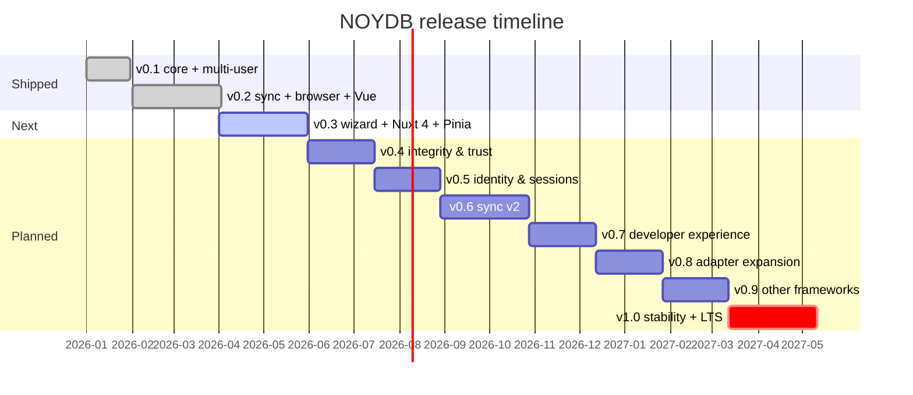

# Roadmap

> **Current:** v0.2 shipped on npm. **Next:** v0.3 — Pinia-first DX + Query & Scale.
>
> Related docs:
> - [Architecture](./docs/architecture.md) — data flow, key hierarchy, threat model
> - [Deployment profiles](./docs/deployment-profiles.md) — pick your stack
> - [Getting started](./docs/getting-started.md) — install and first app
> - [Adapters](./docs/adapters.md) — built-in and custom adapters
> - [End-user features](./docs/end-user-features.md) — what consumers get
> - [Spec](./NOYDB_SPEC.md) — invariants (do not violate)

---

## Status

All five implementation phases from the original plan are complete. NOYDB is published on npm as `@noy-db/*` (core, memory, file, dynamo, s3, browser, vue) with 233 tests passing. The core APIs, crypto, multi-user keyrings, sync engine, and biometric auth are stable. v0.3 turns the focus to **adoption**: making the package trivial to drop into existing Vue/Pinia projects, then layering optional power features (query DSL, indexes, pagination) on top.

---

## Releases

| Version | Status      | Theme                              | Highlights                                                                |
|--------:|-------------|------------------------------------|---------------------------------------------------------------------------|
| 0.1     | ✅ shipped  | Core MVP + multi-user              | crypto, keyring, file/memory adapters, 5-role ACL                         |
| 0.2     | ✅ shipped  | Sync + browser + Vue               | DynamoDB/S3/browser adapters, sync engine, WebAuthn, Vue composables      |
| **0.3** | 🚧 **next** | **Pinia-first DX + query & scale** | `create-noy-db` wizard, Nuxt 4 module, `defineNoydbStore`, query DSL, encrypted indexes, pagination |
| 0.4     | 📋 planned  | Integrity & trust                  | Hash-chained audit log, schema validation, foreign-key refs               |
| 0.5     | 📋 planned  | Identity & sessions                | Session tokens, OIDC bridge, magic links, hardware-key keyrings           |
| 0.6     | 📋 planned  | Sync v2                            | CRDT mode, pluggable conflict policies, presence, partial sync            |
| 0.7     | 📋 planned  | Developer experience               | `noydb` CLI, devtools panel, schema codegen, importers                    |
| 0.8     | 📋 planned  | Adapter expansion                  | R2, D1, Supabase, IPFS, Git, WebDAV, encrypted SQLite, Turso              |
| 0.9     | 📋 planned  | Other framework integrations       | React, Svelte, Solid, Qwik, TanStack Query/Table, Zustand                 |
| 1.0     | 📋 planned  | Stability + LTS release            | API freeze, third-party audit, perf benchmarks, migration tooling         |
| 1.x     | 🔭 vision   | Edge & realtime                    | Edge worker adapter, WebRTC peer sync, encrypted BroadcastChannel         |
| 2.0     | 🔭 vision   | Federation                         | Multi-instance federation, verifiable credentials, ZK proof exports       |



---

## Guiding principles

Every future release respects these:

1. **Zero-knowledge stays zero-knowledge.** Adapters never see plaintext.
2. **Memory-first is the default.** Streaming, pagination, and lazy hydration are opt-in.
3. **Zero runtime crypto deps.** Web Crypto API only.
4. **Six-method adapter contract is sacred.** New capabilities go in core or in optional adapter extension interfaces.
5. **Pinia/Vue ergonomics are first-class.** If a feature makes Vue/Nuxt/Pinia adoption harder, it gets redesigned.
6. **Every feature ships with a `playground/` example** before it's documented as stable.

---

## v0.3 — Pinia-first DX + query & scale

**Goal:** Zero to working encrypted Pinia store in under two minutes. A Vue/Nuxt/Pinia developer either runs `npm create noy-db` (greenfield) or installs `@noy-db/nuxt` (existing project), and gets a fully wired reactive encrypted store without writing boilerplate. Opt into advanced features (query DSL, indexes, sync) incrementally.

### Deliverable summary

| # | Deliverable                                                       | Package                   |
|---|-------------------------------------------------------------------|---------------------------|
| 1 | `npm create noy-db` guided scaffolder                             | `create-noy-db` (new)     |
| 2 | Nuxt 4 module with auto-imports, SSR safety, devtools tab         | `@noy-db/nuxt` (new)      |
| 3 | `nuxi noydb <cmd>` extension (add collection, rotate, verify)     | `@noy-db/nuxt` (new)      |
| 4 | `defineNoydbStore` — one-line Pinia adoption                      | `@noy-db/pinia` (new)     |
| 5 | Pinia plugin for existing stores (`noydb:` option)                | `@noy-db/pinia` (new)     |
| 6 | Reactive query DSL                                                | `@noy-db/core`            |
| 7 | Encrypted secondary indexes                                       | `@noy-db/core`            |
| 8 | Paginated `list()` / streaming `scan()`                           | `@noy-db/core` + adapters |
| 9 | Lazy hydration + LRU eviction                                     | `@noy-db/core`            |

Items 1–5 are the **adoption surface**. Items 6–9 are the **power surface** that adoption unlocks.

### 1. `create-noy-db` — guided scaffolder

```bash
npm  create noy-db@latest my-app
pnpm create noy-db        my-app
yarn create noy-db        my-app
bun  create noy-db        my-app
```

A standalone scaffolder built on `@clack/prompts`. Detects framework / package manager / TypeScript from the existing project (or generates a fresh template), then asks at most 8 questions: adapter, sync target, auth mode, multi-user, schema validator, sample data, privacy guard. Installs only the packages the user picked, generates working code (not stubs), and runs an end-to-end integrity check (open → write → read → decrypt → verify ledger) before declaring success.

Constraints: never asks for or stores secrets, never uploads telemetry, always shows a diff before mutating existing files (`nuxt.config.ts` is updated via AST through `magicast`). Templates live inside the package — works offline. Prompts available in English and Thai.

### 2. `@noy-db/nuxt` — Nuxt 4 module

**Nuxt 4+ exclusive.** No Nuxt 3 compatibility layer. Uses `defineNuxtModule` v4, Nitro 3, Vue 3.5+, ESM-only output, Node 20+.

```ts
// nuxt.config.ts
export default defineNuxtConfig({
  modules: ['@noy-db/nuxt'],
  noydb: {
    adapter: 'browser',
    sync: { adapter: 'dynamo', table: 'noydb-prod', mode: 'auto' },
    auth: { mode: 'biometric', sessionTimeout: '15m' },
    devtools: true,
    pinia: true,
  },
});
```

What it adds:

- **Auto-imports** for `useNoydb`, `useCollection`, `useQuery`, `useSync`, `defineNoydbStore` — no manual imports in components.
- **SSR safety.** Runtime plugin is `.client.ts`-only. Server bundle contains zero references to `crypto.subtle` or any DEK/KEK symbols (CI-asserted via `nitro:build:before`). `useCollection()` returns an empty reactive ref during SSR; templates render skeletons; client hydrates with real data after decrypt.
- **Devtools tab.** Live compartment tree, sync status, ledger tail, query playground, keyring inspector. Built on `@nuxt/devtools-kit` v2; absent in production builds.
- **`useFetch`-shaped composables.** `useCollection()` returns `{ data, status, error, refresh, clear }` to match Nuxt 4's `useAsyncData` contract.
- **Optional Nitro server proxy** for adapter calls (off by default). Lets users put NOYDB behind a Nuxt-managed auth gate while keeping zero-knowledge — the server proxies ciphertext, never sees keys.
- **Optional Nitro tasks** for scheduled encrypted backups.

Nuxt 3 users: keep using `@noy-db/vue` + `@noy-db/pinia` directly with a hand-written plugin file. The README links to a 15-line snippet.

### 3. `nuxi noydb <command>` extension

The module registers a `nuxi` namespace that re-uses the scaffolder's wizard for ongoing project commands:

```bash
nuxi noydb add invoices                  # scaffold a new collection + store
nuxi noydb add user accountant operator  # add a keyring user
nuxi noydb rotate                        # interactive key rotation
nuxi noydb verify                        # run the integrity check
nuxi noydb seed                          # re-run the seeder
nuxi noydb backup s3://bucket/backups/   # one-shot backup
```

Same code paths as the install wizard, exposed as ongoing project commands.

### 4. `@noy-db/pinia` — greenfield path

```ts
// stores/invoices.ts
import { defineNoydbStore } from '@noy-db/pinia';

export const useInvoices = defineNoydbStore('invoices', {
  compartment: 'C101',
  schema: InvoiceSchema, // optional; gives typed records + validation
});
```

```vue
<script setup lang="ts">
const invoices = useInvoices();
await invoices.$ready;
</script>
<template>
  <div v-for="inv in invoices.items" :key="inv.id">{{ inv.amount }}</div>
</template>
```

The store exposes `items`, `byId(id)`, `count`, `add()`, `update()`, `remove()`, `refresh()`, `$ready`, `$ledger`. Devtools, `storeToRefs`, SSR, and `pinia-plugin-persistedstate` keep working unmodified.

### 5. `@noy-db/pinia` — augmentation path (existing stores)

```ts
import { createNoydbPiniaPlugin } from '@noy-db/pinia';

pinia.use(createNoydbPiniaPlugin({
  adapter: jsonFile({ dir: './data' }),
  user: 'owner-01',
  secret: () => promptPassphrase(),
}));

// existing store — add one option, no component changes:
export const useClients = defineStore('clients', {
  state: () => ({ list: [] as Client[] }),
  noydb: { compartment: 'C101', collection: 'clients', persist: 'list' },
  actions: { add(c: Client) { this.list.push(c); } },
});
```

### 6–9. Power features (opt-in, all surfaced through the Pinia store)

- **Reactive query DSL.** `invoices.query().where('status', '==', 'open').orderBy('dueDate').live()`. Operators: `==`, `!=`, `<`, `<=`, `>`, `>=`, `in`, `contains`, `startsWith`, `between`, plus `.filter(fn)`. Composite via `.and()`/`.or()`. Client-side only — preserves zero-knowledge.
- **Encrypted secondary indexes.** Declared per-collection: `indexes: ['status', 'dueDate', { fields: ['clientId', 'status'] }]`. Computed client-side after decryption, stored as a separate AES-256-GCM blob. Adapter still sees only ciphertext.
- **Paginated `list()` / streaming `scan()`.** New optional `listPage(cursor?, limit?)` adapter extension. Pinia: `await invoices.loadMore()`.
- **Lazy collection hydration + LRU eviction.** `{ cache: { maxRecords: 5000, maxBytes: '50MB' } }`. `prefetch: true` keeps the v0.2 eager-load behavior.

### Acceptance criteria

**Scaffolder:**
- [ ] `npm create noy-db@latest` works on Node 20+ across macOS, Linux, Windows
- [ ] All four package managers (npm, pnpm, yarn, bun) detected and used for install
- [ ] Generated Nuxt 4 starter passes `dev` + `build` + `typecheck` cleanly
- [ ] End-to-end install + verify under 60 seconds on a warm npm cache
- [ ] Privacy guard pre-commit hook installed only on opt-in
- [ ] Passphrases never written to disk; AWS credentials never requested
- [ ] Wizard re-runnable inside an existing project to add collections
- [ ] Prompts available in English and Thai
- [ ] CI matrix exercises a representative subset of (framework × adapter × sync × auth) combinations

**Nuxt module:**
- [ ] One-line install: `pnpm add @noy-db/nuxt` + `modules: ['@noy-db/nuxt']` produces a working encrypted store with no other code
- [ ] All composables auto-imported without manual `import` statements
- [ ] Server bundle contains zero references to `crypto.subtle`, `decrypt`, or DEK/KEK symbols (CI-verified)
- [ ] Devtools tab shows live compartment state in dev and is absent in production
- [ ] `nuxi noydb <command>` namespace registered when the module is installed
- [ ] Type-checks against `nuxt.config.ts` with autocomplete on every option
- [ ] Reference Nuxt 4 accounting demo in `playground/nuxt/` works with one config block

**Pinia integration:**
- [ ] `defineNoydbStore` works as a drop-in for `defineStore` in a clean Vue 3 + Pinia project
- [ ] Existing Pinia stores opt in via the `noydb:` option without component changes
- [ ] Devtools, `storeToRefs`, SSR, and `pinia-plugin-persistedstate` all keep working

**Power features:**
- [ ] Query DSL passes a parity test against `Array.filter` for 50 random predicates
- [ ] Indexed queries are measurably faster than linear scans on a 10K-record benchmark
- [ ] Streaming `scan()` handles a 100K-record collection in under 200MB peak memory
- [ ] Reference Vue/Nuxt accounting demo in `playground/` uses **only** the Pinia API — no direct `Compartment`/`Collection` calls

---

## v0.4 — Integrity & trust

**Goal:** Tamper-evident audit, schema-validated records, soft relational integrity, delta-compressed history.

- **Hash-chained audit log.** Every mutation appends `{ prevHash, op, collection, id, version, ts, actor, payloadHash }`. `verifyLedger()` returns the first divergent index. Merkle proofs via `ledger.proveEntry(n)`. Optional anchoring of `ledger.head()` to Bitcoin/Ethereum/OpenTimestamps stays in user code — core has zero blockchain deps. Replaces full-snapshot history as the durable audit primitive.
- **Delta history (RFC 6902 JSON Patch).** Storage scales with change size, not record size. `pruneHistory()` folds N oldest deltas into a new base snapshot.
- **Schema validation (Standard Schema).** Zod, Valibot, ArkType, Effect Schema. Validation runs before encryption on `put()` and after decryption on `get()`. Generates TS types automatically; the Pinia store inherits the type info.
- **Foreign-key references (`ref()`).** Modes: `strict`, `warn`, `cascade`. `compartment.checkIntegrity()` reports orphans. Opt-in.
- **Verifiable backups.** `compartment.backup()` includes the ledger head; `restore()` refuses tampered backups.

---

## v0.5 — Identity & sessions

**Goal:** Solve "passphrase unlock is awkward for client portals."

- **Session tokens.** Unlock once with passphrase or biometric, get a JWE valid for N minutes. KEK wrapped with a session-scoped non-extractable WebCrypto key. Closing the tab destroys the session.
- **OAuth/OIDC bridge (`@noy-db/auth-oidc`).** Federated login → server returns a wrapped DEK fragment → combined client-side with a device secret to reconstruct the KEK. Server never sees plaintext or the unwrapped key. Same split-key pattern as Bitwarden's SSO key connector.
- **Magic-link unlock.** Email a one-time link → derives a *viewer-only* KEK from a server-issued ephemeral secret. Read-only client portals.
- **Hardware-key keyrings (`@noy-db/auth-webauthn`).** Full WebAuthn unwrap (YubiKey, Touch ID, Face ID, Windows Hello).
- **Session policies.** `{ idleTimeout: '15m', absoluteTimeout: '8h', requireBiometricForExport: true }`.

---

## v0.6 — Sync v2

**Goal:** Deterministic conflict resolution; collaborative editing where it matters.

- **Pluggable conflict policies.** `'last-writer-wins' | 'first-writer-wins' | 'manual' | CustomMergeFn`. Manual mode surfaces conflicts via `sync.on('conflict', ...)` for UI resolution.
- **CRDT mode.** Optional `crdt: 'lww-map' | 'rga' | 'yjs'` per collection. Deterministic, commutative merges.
- **Yjs interop (`@noy-db/yjs`).** Rich-text fields with collaborative editing while the envelope stays encrypted at rest.
- **Presence and live cursors.** Encrypted ephemeral channel keyed by a room key derived from the collection DEK.
- **Partial sync.** Filter by collection or by `modifiedSince`.
- **Sync transactions.** Two-phase commit at the sync engine level.

---

## v0.7 — Developer experience

**Goal:** Make NOYDB easy to use, easy to debug, easy to import existing data into.

- **`noydb` CLI.** `init`, `open` (REPL), `dump`, `load`, `codegen`, `migrate`, `verify`, `import`.
- **Browser DevTools panel.** Compartments, collections, decrypted records (only with active session), ledger, sync status, query playground.
- **VSCode extension.** Schema-aware autocomplete for `where()` field names, hover-preview, run queries from the editor.
- **Importers.** `@noy-db/import-postgres`, `@noy-db/import-sqlite`, `@noy-db/import-csv`, `@noy-db/import-firebase`, `@noy-db/import-mongo`.
- **Type generation.** `noydb codegen` → fully typed `db.ts`.
- **Test utilities (`@noy-db/testing`).** `createTestDb()`, `seed()`, `snapshot()`, time-travel mocks, conflict simulators.

---

## v0.8 — Adapter expansion

| Adapter                       | Why                                                                  |
|-------------------------------|----------------------------------------------------------------------|
| `@noy-db/cloudflare-r2`       | Cheap S3-compatible, no egress fees                                  |
| `@noy-db/cloudflare-d1`       | SQLite at the edge, free tier                                        |
| `@noy-db/supabase`            | One-click Postgres + storage                                         |
| `@noy-db/ipfs`                | Content-addressed; fits the hash-chain ledger naturally              |
| `@noy-db/git`                 | Compartment = git repo, history = commits, sync = push/pull          |
| `@noy-db/webdav`              | Nextcloud, ownCloud, any WebDAV server                               |
| `@noy-db/sqlite-encrypted`    | Single-file backend (better than JSON for >10K records)              |
| `@noy-db/turso`               | Edge SQLite with replication                                         |
| `@noy-db/firestore`           | Firebase teams                                                       |
| `@noy-db/postgres`            | Postgres `jsonb` column, single-table pattern                        |

---

## v0.9 — Other framework integrations

Pinia/Vue is already covered in v0.3. v0.9 brings the same first-class story to other ecosystems.

| Package                     | Provides                                                       |
|-----------------------------|----------------------------------------------------------------|
| `@noy-db/react`             | `useNoydb`, `useCollection`, `useQuery`, `useSync` hooks       |
| `@noy-db/svelte`            | Reactive stores                                                |
| `@noy-db/solid`             | Signals                                                        |
| `@noy-db/qwik`              | Resumable queries                                              |
| `@noy-db/tanstack-query`    | Query function adapter — paginate/infinite-scroll              |
| `@noy-db/tanstack-table`    | Bridge for the existing `useSmartTable` pattern                |
| `@noy-db/zustand`           | Zustand store factory mirroring `defineNoydbStore`             |

All share one core implementation; framework packages stay thin (~200 LoC each).

---

## v1.0 — Stability + LTS release

- API freeze. Every public symbol marked `@stable`. Semver enforced.
- Third-party security audit of crypto, sync, and access control.
- Performance benchmarks published; tracked in CI with regression alerts.
- Migration tooling: `noydb migrate --from 0.x` for envelope/keyring schema changes.
- Documentation site with searchable API docs, recipes, video walkthroughs.
- Reference apps: accounting demo (Vue/Pinia), personal journal (React), shared note-taker (Svelte), small CRM (Nuxt).
- LTS branch with security backports for 18 months.

---

## v1.x — Edge & realtime

- **Edge worker adapter.** NOYDB inside Cloudflare Workers / Deno Deploy / Vercel Edge.
- **WebRTC peer sync (`@noy-db/p2p`).** Direct browser-to-browser, encrypted, no server in the middle. TURN fallback only sees ciphertext.
- **Encrypted BroadcastChannel.** Multi-tab session and hot cache sharing.
- **Reactive subscriptions over the wire.** `collection.subscribe(query, callback)` works across tabs, peers, and edge workers.

---

## v2.0 — Federation & verifiable credentials

- **Multi-instance federation.** Two compartments at two organizations share a *bridged collection* via ECDH-derived session keys; each side keeps its own DEK.
- **Verifiable credentials (W3C VC).** Sign records as VCs; pairs with the v0.4 ledger for non-repudiation.
- **Zero-knowledge proofs.** "I have at least N invoices over $X without showing them" via zk-SNARKs. Gated by a real use case.
- **Compartment marketplaces.** Sealed encrypted bundles distributed and re-keyed on first open.

---

## Concerns → releases

| Concern                                              | Addressed in                          |
|------------------------------------------------------|---------------------------------------|
| Hard to adopt in existing Vue/Pinia projects         | **v0.3**                              |
| No query language                                    | v0.3                                  |
| Per-collection in-memory cache scaling               | v0.3                                  |
| `list()` returns full objects, not paginated         | v0.3                                  |
| Audit history = full snapshots                       | v0.4                                  |
| No relational integrity                              | v0.4                                  |
| Blockchain ledger usefulness                         | v0.4 (hash-chain, optional anchoring) |
| Passphrase unlock awkward for client portals         | v0.5                                  |
| Sync conflict resolution model unclear               | v0.6                                  |

---

## Cross-cutting investments

- **Bundle size budget.** Core under 30 KB gzipped. Each adapter under 10 KB.
- **Tree-shakeable feature flags.** Indexes, ledger, schema validation each cost zero bytes if unused.
- **WASM crypto fast path.** Optional accelerator for >10MB bulk encrypts. Never a dependency.
- **Accessibility.** Vue/Nuxt UI primitives produce ARIA-correct output.
- **i18n of error messages.** Especially Thai, given the first consumer.
- **Telemetry.** Opt-in only, local-first. `noydb stats` shows your own usage; nothing leaves the device.

---

## Contributing

Open a discussion before opening a PR that touches anything past v0.4 — the further out, the more likely the design will shift. v0.3 PRs welcome against an `0.3-dev` branch. Anything that violates the *Guiding principles* is out of scope, no matter how exciting.

---

*Roadmap v3.1 — 2026-04-06*
