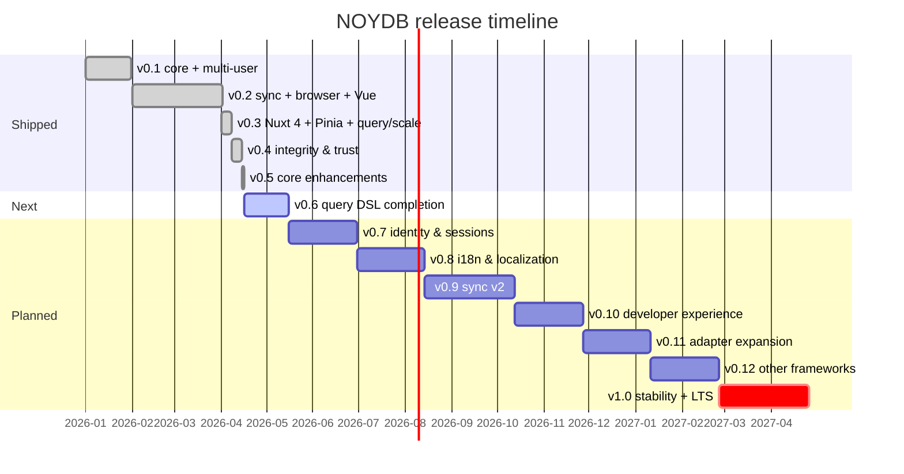

# Roadmap

> **Current:** v0.4.1 shipped on npm — all 10 `@noy-db/*` packages unified on a single version line. Integrity & trust features: schema validation, hash-chained ledger, delta history, FK refs, verifiable backups. **Next:** v0.5 — Core enhancements + scaffolder polish.
>
> Related docs:
> - [Architecture](./docs/architecture.md) — data flow, key hierarchy, threat model
> - [Deployment profiles](./docs/deployment-profiles.md) — pick your stack
> - [Getting started](./docs/getting-started.md) — install and first app
> - [Adapters](./docs/adapters.md) — built-in and custom adapters
> - [End-user features](./docs/end-user-features.md) — what consumers get
> - [Spec](./NOYDB_SPEC.md) — invariants (do not violate)

---

## Status

v0.4.1 shipped on npm. All 10 `@noy-db/*` packages are now unified on the **0.4.1** version line — `core`, `pinia`, `memory`, `file`, `dynamo`, `s3`, `browser`, `vue`, `nuxt`, `create`. **654 tests** passing across the monorepo (376 in `@noy-db/core` alone — up from 269 at v0.3 ship). The v0.4 epic added the integrity layer on top of v0.3's adoption surface: every record can be schema-validated, every mutation recorded in a tamper-evident hash chain, history delta-encoded for storage efficiency, soft FK references enforced per-collection, and backups verified end-to-end on load. The 0.4.1 patch fixes a release-hygiene bug where `workspace:*` in `peerDependencies` published as exact-version pins, making the 0.4.0 adapters uninstallable alongside a newer core. The reference Nuxt 4 demo at `playground/nuxt/` is the integration test for v0.3 AND v0.4 — its invoices store is backed by a Zod schema, exercising the validation path end-to-end. v0.5 turns to **core enhancements + scaffolder polish**: the wizard work (i18n, augment mode, CLI subcommands) is already shipped, and the release adds three small core enhancements — `exportStream()`/`exportJSON()` for plaintext export with the `@noy-db/decrypt-*` family policy locked in, `queryAcross` for cross-compartment role-scoped reads, and admin-grants-admin bounded delegation to remove the single-owner bus-factor. Identity & sessions slipped one slot to v0.7 to make room for the smaller, more orthogonal enhancements that were ready sooner.

---

## Releases

| Version | Status      | Theme                              | Highlights                                                                |
|--------:|-------------|------------------------------------|---------------------------------------------------------------------------|
| 0.1     | ✅ shipped  | Core MVP + multi-user              | crypto, keyring, file/memory adapters, 5-role ACL                         |
| 0.2     | ✅ shipped  | Sync + browser + Vue               | DynamoDB/S3/browser adapters, sync engine, WebAuthn, Vue composables      |
| 0.3     | ✅ shipped  | Pinia-first DX + query & scale     | Nuxt 4 module, `@noy-db/pinia`, query DSL, secondary indexes, pagination, lazy LRU |
| 0.3.1   | ✅ shipped  | Scaffolder + CLI                   | `@noy-db/create` wizard, `noy-db add`/`verify`, Nuxt 4 starter template      |
| 0.4     | ✅ shipped  | Integrity & trust                  | Schema validation, hash-chained ledger, delta history, FK refs, verifiable backups |
| 0.4.1   | ✅ shipped  | Release hygiene patch              | Peer dep pinning fix (`workspace:^`); unified `@noy-db/*` on one version line  |
| 0.5     | ✅ shipped  | Core enhancements + scaffolder polish | Wizard i18n + augment mode + CLI subcommands, `exportStream`/`exportJSON` (ACL-scoped), cross-compartment queries, admin-grants-admin delegation |
| **0.6** | 🚧 **next** | **Query DSL completion**           | Joins (eager + live + multi-FK chaining), aggregations v1 (built-in reducers + groupBy + scan)        |
| 0.7     | 📋 planned  | Identity & sessions                | Session tokens, OIDC bridge, magic links, hardware-key keyrings           |
| 0.8     | 📋 planned  | i18n & localization                | `dictKey` + `i18nText` schema primitives, `plaintextTranslator` hook, per-locale read resolution, dictionary admin operations, export integration |
| 0.9     | 📋 planned  | Sync v2                            | CRDT mode, pluggable conflict policies, presence, partial sync            |
| 0.10    | 📋 planned  | Developer experience               | `noydb` CLI, devtools panel, schema codegen, importers                    |
| 0.11    | 📋 planned  | Adapter expansion                  | R2, D1, Supabase, IPFS, Git, WebDAV, encrypted SQLite, Turso              |
| 0.12    | 📋 planned  | Other framework integrations       | React, Svelte, Solid, Qwik, TanStack Query/Table, Zustand                 |
| 1.0     | 📋 planned  | Stability + LTS release            | API freeze, third-party audit, perf benchmarks, migration tooling         |
| 1.x     | 🔭 vision   | Edge & realtime                    | Edge worker adapter, WebRTC peer sync, encrypted BroadcastChannel         |
| 2.0     | 🔭 vision   | Federation                         | Multi-instance federation, verifiable credentials, ZK proof exports       |



---

## Guiding principles

Every future release respects these:

1. **Zero-knowledge stays zero-knowledge.** Adapters never see plaintext.
2. **Memory-first is the default.** Streaming, pagination, and lazy hydration are opt-in.
3. **Zero runtime crypto deps.** Web Crypto API only.
4. **Six-method adapter contract is sacred.** New capabilities go in core or in optional adapter extension interfaces.
5. **Pinia/Vue ergonomics are first-class.** If a feature makes Vue/Nuxt/Pinia adoption harder, it gets redesigned.
6. **Every feature ships with a `playground/` example** before it's documented as stable.

---

## v0.3 — Pinia-first DX + query & scale

**Goal:** Zero to working encrypted Pinia store in under two minutes. A Vue/Nuxt/Pinia developer either runs `npm create noy-db` (greenfield) or installs `@noy-db/nuxt` (existing project), and gets a fully wired reactive encrypted store without writing boilerplate. Opt into advanced features (query DSL, indexes, sync) incrementally.

### Deliverable summary

| # | Deliverable                                                       | Package                   |
|---|-------------------------------------------------------------------|---------------------------|
| 1 | `npm create noy-db` guided scaffolder                             | `create-noy-db` (new)     |
| 2 | Nuxt 4 module with auto-imports, SSR safety, devtools tab         | `@noy-db/nuxt` (new)      |
| 3 | `nuxi noydb <cmd>` extension (add collection, rotate, verify)     | `@noy-db/nuxt` (new)      |
| 4 | `defineNoydbStore` — one-line Pinia adoption                      | `@noy-db/pinia` (new)     |
| 5 | Pinia plugin for existing stores (`noydb:` option)                | `@noy-db/pinia` (new)     |
| 6 | Reactive query DSL                                                | `@noy-db/core`            |
| 7 | Encrypted secondary indexes                                       | `@noy-db/core`            |
| 8 | Paginated `list()` / streaming `scan()`                           | `@noy-db/core` + adapters |
| 9 | Lazy hydration + LRU eviction                                     | `@noy-db/core`            |

Items 1–5 are the **adoption surface**. Items 6–9 are the **power surface** that adoption unlocks.

### 1. `create-noy-db` — guided scaffolder

```bash
npm  create noy-db@latest my-app
pnpm create noy-db        my-app
yarn create noy-db        my-app
bun  create noy-db        my-app
```

A standalone scaffolder built on `@clack/prompts`. Detects framework / package manager / TypeScript from the existing project (or generates a fresh template), then asks at most 8 questions: adapter, sync target, auth mode, multi-user, schema validator, sample data, privacy guard. Installs only the packages the user picked, generates working code (not stubs), and runs an end-to-end integrity check (open → write → read → decrypt → verify ledger) before declaring success.

Constraints: never asks for or stores secrets, never uploads telemetry, always shows a diff before mutating existing files (`nuxt.config.ts` is updated via AST through `magicast`). Templates live inside the package — works offline. Prompts available in English and Thai.

### 2. `@noy-db/nuxt` — Nuxt 4 module

**Nuxt 4+ exclusive.** No Nuxt 3 compatibility layer. Uses `defineNuxtModule` v4, Nitro 3, Vue 3.5+, ESM-only output, Node 20+.

```ts
// nuxt.config.ts
export default defineNuxtConfig({
  modules: ['@noy-db/nuxt'],
  noydb: {
    adapter: 'browser',
    sync: { adapter: 'dynamo', table: 'noydb-prod', mode: 'auto' },
    auth: { mode: 'biometric', sessionTimeout: '15m' },
    devtools: true,
    pinia: true,
  },
});
```

What it adds:

- **Auto-imports** for `useNoydb`, `useCollection`, `useQuery`, `useSync`, `defineNoydbStore` — no manual imports in components.
- **SSR safety.** Runtime plugin is `.client.ts`-only. Server bundle contains zero references to `crypto.subtle` or any DEK/KEK symbols (CI-asserted via `nitro:build:before`). `useCollection()` returns an empty reactive ref during SSR; templates render skeletons; client hydrates with real data after decrypt.
- **Devtools tab.** Live compartment tree, sync status, ledger tail, query playground, keyring inspector. Built on `@nuxt/devtools-kit` v2; absent in production builds.
- **`useFetch`-shaped composables.** `useCollection()` returns `{ data, status, error, refresh, clear }` to match Nuxt 4's `useAsyncData` contract.
- **Optional Nitro server proxy** for adapter calls (off by default). Lets users put NOYDB behind a Nuxt-managed auth gate while keeping zero-knowledge — the server proxies ciphertext, never sees keys.
- **Optional Nitro tasks** for scheduled encrypted backups.

Nuxt 3 users: keep using `@noy-db/vue` + `@noy-db/pinia` directly with a hand-written plugin file. The README links to a 15-line snippet.

### 3. `nuxi noydb <command>` extension

The module registers a `nuxi` namespace that re-uses the scaffolder's wizard for ongoing project commands:

```bash
nuxi noydb add invoices                  # scaffold a new collection + store
nuxi noydb add user accountant operator  # add a keyring user
nuxi noydb rotate                        # interactive key rotation
nuxi noydb verify                        # run the integrity check
nuxi noydb seed                          # re-run the seeder
nuxi noydb backup s3://bucket/backups/   # one-shot backup
```

Same code paths as the install wizard, exposed as ongoing project commands.

### 4. `@noy-db/pinia` — greenfield path

```ts
// stores/invoices.ts
import { defineNoydbStore } from '@noy-db/pinia';

export const useInvoices = defineNoydbStore('invoices', {
  compartment: 'C101',
  schema: InvoiceSchema, // optional; gives typed records + validation
});
```

```vue
<script setup lang="ts">
const invoices = useInvoices();
await invoices.$ready;
</script>
<template>
  <div v-for="inv in invoices.items" :key="inv.id">{{ inv.amount }}</div>
</template>
```

The store exposes `items`, `byId(id)`, `count`, `add()`, `update()`, `remove()`, `refresh()`, `$ready`, `$ledger`. Devtools, `storeToRefs`, SSR, and `pinia-plugin-persistedstate` keep working unmodified.

### 5. `@noy-db/pinia` — augmentation path (existing stores)

```ts
import { createNoydbPiniaPlugin } from '@noy-db/pinia';

pinia.use(createNoydbPiniaPlugin({
  adapter: jsonFile({ dir: './data' }),
  user: 'owner-01',
  secret: () => promptPassphrase(),
}));

// existing store — add one option, no component changes:
export const useClients = defineStore('clients', {
  state: () => ({ list: [] as Client[] }),
  noydb: { compartment: 'C101', collection: 'clients', persist: 'list' },
  actions: { add(c: Client) { this.list.push(c); } },
});
```

### 6–9. Power features (opt-in, all surfaced through the Pinia store)

- **Reactive query DSL.** `invoices.query().where('status', '==', 'open').orderBy('dueDate').live()`. Operators: `==`, `!=`, `<`, `<=`, `>`, `>=`, `in`, `contains`, `startsWith`, `between`, plus `.filter(fn)`. Composite via `.and()`/`.or()`. Client-side only — preserves zero-knowledge.
- **Encrypted secondary indexes.** Declared per-collection: `indexes: ['status', 'dueDate', { fields: ['clientId', 'status'] }]`. Computed client-side after decryption, stored as a separate AES-256-GCM blob. Adapter still sees only ciphertext.
- **Paginated `list()` / streaming `scan()`.** New optional `listPage(cursor?, limit?)` adapter extension. Pinia: `await invoices.loadMore()`.
- **Lazy collection hydration + LRU eviction.** `{ cache: { maxRecords: 5000, maxBytes: '50MB' } }`. `prefetch: true` keeps the v0.2 eager-load behavior.

### Acceptance criteria

**Scaffolder:**
- [ ] `npm create noy-db@latest` works on Node 20+ across macOS, Linux, Windows
- [ ] All four package managers (npm, pnpm, yarn, bun) detected and used for install
- [ ] Generated Nuxt 4 starter passes `dev` + `build` + `typecheck` cleanly
- [ ] End-to-end install + verify under 60 seconds on a warm npm cache
- [ ] Privacy guard pre-commit hook installed only on opt-in
- [ ] Passphrases never written to disk; AWS credentials never requested
- [ ] Wizard re-runnable inside an existing project to add collections
- [ ] Prompts available in English and Thai
- [ ] CI matrix exercises a representative subset of (framework × adapter × sync × auth) combinations

**Nuxt module:**
- [ ] One-line install: `pnpm add @noy-db/nuxt` + `modules: ['@noy-db/nuxt']` produces a working encrypted store with no other code
- [ ] All composables auto-imported without manual `import` statements
- [ ] Server bundle contains zero references to `crypto.subtle`, `decrypt`, or DEK/KEK symbols (CI-verified)
- [ ] Devtools tab shows live compartment state in dev and is absent in production
- [ ] `nuxi noydb <command>` namespace registered when the module is installed
- [ ] Type-checks against `nuxt.config.ts` with autocomplete on every option
- [ ] Reference Nuxt 4 accounting demo in `playground/nuxt/` works with one config block

**Pinia integration:**
- [ ] `defineNoydbStore` works as a drop-in for `defineStore` in a clean Vue 3 + Pinia project
- [ ] Existing Pinia stores opt in via the `noydb:` option without component changes
- [ ] Devtools, `storeToRefs`, SSR, and `pinia-plugin-persistedstate` all keep working

**Power features:**
- [ ] Query DSL passes a parity test against `Array.filter` for 50 random predicates
- [ ] Indexed queries are measurably faster than linear scans on a 10K-record benchmark
- [ ] Streaming `scan()` handles a 100K-record collection in under 200MB peak memory
- [ ] Reference Vue/Nuxt accounting demo in `playground/` uses **only** the Pinia API — no direct `Compartment`/`Collection` calls

---

## v0.4 — Integrity & trust

**Goal:** Tamper-evident audit, schema-validated records, soft relational integrity, delta-compressed history.

- **Hash-chained audit log.** Every mutation appends `{ prevHash, op, collection, id, version, ts, actor, payloadHash }`. `verifyLedger()` returns the first divergent index. Merkle proofs via `ledger.proveEntry(n)`. Optional anchoring of `ledger.head()` to Bitcoin/Ethereum/OpenTimestamps stays in user code — core has zero blockchain deps. Replaces full-snapshot history as the durable audit primitive.
- **Delta history (RFC 6902 JSON Patch).** Storage scales with change size, not record size. `pruneHistory()` folds N oldest deltas into a new base snapshot.
- **Schema validation (Standard Schema).** Zod, Valibot, ArkType, Effect Schema. Validation runs before encryption on `put()` and after decryption on `get()`. Generates TS types automatically; the Pinia store inherits the type info.
- **Foreign-key references (`ref()`).** Modes: `strict`, `warn`, `cascade`. `compartment.checkIntegrity()` reports orphans. Opt-in.
- **Verifiable backups.** `compartment.backup()` includes the ledger head; `restore()` refuses tampered backups.

---

## v0.5 — Core enhancements + scaffolder polish

**Goal:** Tighten the v0.4 core surface with the small, orthogonal enhancements that real consumers have asked for, and finish the scaffolder polish from v0.3.1. This release is **deliberately not themed around a single big epic** — it's a focused bundle of independent improvements that all share "low risk, high consumer value, no shared planner work."

### Scaffolder polish (already shipped)

- **Wizard i18n** (#36) — Thai prompts and notes, `--lang` flag, POSIX env-var auto-detection
- **Augment mode** (#37) — wizard patches an existing `nuxt.config.ts` via magicast with a confirmable diff
- **CLI subcommands** (#38) — `noy-db rotate`, `noy-db add user`, `noy-db backup` for ongoing project maintenance
- **E2E CI matrix** (#40) — wizard validated on every PR across OS × Node × package-manager cells

### Core enhancements (this release)

- **`exportStream()` + `exportJSON()` core primitive (#72).** Authorization-aware streaming export of plaintext records. `exportStream()` yields per-collection chunks with schema + ref metadata, going through the normal ACL path. `exportJSON()` is the universal default helper. Both APIs carry an explicit "this writes plaintext to disk" warning block in JSDoc and README — see the `@noy-db/decrypt-*` section below for the surrounding package family policy.
- **Cross-compartment role-scoped queries (#63).** `Noydb.listAccessibleCompartments({ minRole })` enumerates compartments the current keyring can unlock (no existence leaks — the local keyring is the source of truth, no adapter probes), and `Noydb.queryAcross(ids, fn)` fans out a per-compartment callback over them with opt-in concurrency. Composes with `exportStream()` to give cross-compartment plaintext export for free.
- **Admin-grants-admin bounded delegation (#62).** Allow `admin` role-holders to grant another `admin`, with two guardrails: (1) the granted admin's permissions must be a **subset** of the granting admin's (no privilege escalation, enforced at `grant()` time via `PrivilegeEscalationError`); (2) **cascade revoke** — when an admin is revoked, every admin they granted is revoked too (the ledger already records grantor attribution, so the delegation tree is reconstructable). Solves the single-owner bus-factor risk for multi-admin teams.
- **SVG infographics refresh** (#57) — update the diagrams in `docs/` to reflect v0.4 positioning.

### What's NOT in v0.5

- **Identity & sessions** — moved to v0.7. The session-token / OIDC / magic-link / WebAuthn epic was the original v0.5 theme; it slipped one slot to make room for the smaller core enhancements that were ready to ship sooner.
- **Joins / aggregations** — moved to v0.6 (see below). They're a coherent epic of their own and want their own focused review pass.

---

## v0.6 — Query DSL completion

**Goal:** Finish the query DSL story so consumers can express joins and aggregations directly in `.query()` instead of folding in userland. Both features extend the same `.query()` builder; they should land in the same release so the docs cover them together.

### Joins (spawned from discussion #64)

- **Eager single-FK join (#73)** — `.join('clientId', { as: 'client' })` resolves through the existing v0.4 `ref()` declaration. Two planner paths: indexed nested-loop (when the FK target field is in the right side's `indexes`) and hash join (otherwise). Hard memory ceiling at `JoinTooLargeError` (default 50k rows per side, override via `{ maxRows }`). Same-compartment only — cross-compartment correlation goes through `queryAcross` (#63).
- **Live joins (#74)** — `.join().live()` produces a merged subscription over both collections' change streams. Right-side disappearance follows the v0.4 ref mode (`strict` / `warn` / `cascade`).
- **Multi-FK chaining (#75)** — `.join('clientId').join('parentId')` for queries that follow more than one relationship. Each join uses its own planner strategy.

### Aggregations v1 (spawned from discussion #65)

- **Built-in reducers** — `count()`, `sum(field)`, `avg(field)`, `min(field)`, `max(field)` reducer factories.
- **`.aggregate({ ... })` terminal** with a `.live()` mode that incrementally maintains running totals for `sum`/`count`/`avg`. Documented O(N) worst case for `min`/`max` on the "current extremum was just deleted" edge case.
- **`groupBy(field)`** with a documented cardinality warn at 10k groups.
- **`scan().aggregate(...)`** for memory-bounded aggregation over collections beyond the in-memory ceiling.
- **Out of scope for v1, tracked separately:** per-row callback reducers (`.reduce(fn, init)`), index-backed aggregation planner, multi-level groupBy, aggregations across joins. These wait for a real consumer ask before being scheduled.

### Out of v0.6 (deferred)

- **Streaming joins over `scan()`** (#76) — different planner shape, lower priority. Graduates to a milestone when a consumer hits the v1 row ceiling and asks for it.

---

## v0.7 — Identity & sessions

**Goal:** Solve "passphrase unlock is awkward for client portals." (Slipped from v0.5 to make room for core enhancements + query DSL — the epic is unchanged.)

- **Session tokens.** Unlock once with passphrase or biometric, get a JWE valid for N minutes. KEK wrapped with a session-scoped non-extractable WebCrypto key. Closing the tab destroys the session.
- **OAuth/OIDC bridge (`@noy-db/auth-oidc`).** Federated login → server returns a wrapped DEK fragment → combined client-side with a device secret to reconstruct the KEK. Server never sees plaintext or the unwrapped key. Same split-key pattern as Bitwarden's SSO key connector.
- **Magic-link unlock.** Email a one-time link → derives a *viewer-only* KEK from a server-issued ephemeral secret. Read-only client portals.
- **Hardware-key keyrings (`@noy-db/auth-webauthn`).** Full WebAuthn unwrap (YubiKey, Touch ID, Face ID, Windows Hello).
- **Session policies.** `{ idleTimeout: '15m', absoluteTimeout: '8h', requireBiometricForExport: true }`.

---

## v0.8 — Internationalization & dictionaries

**Goal:** Make i18n a first-class schema primitive instead of something every consumer hand-rolls on top of the library. Spawned from discussion #78.

The proposal lands as **two structurally distinct schema primitives** because i18n content in real schemas splits into two cases that don't compose into one API:

### `dictKey('name')` — normalized dictionary keys

Bounded sets of stable values (status enums, category codes, filing types, role names) where the *set* is known and the *labels* differ per locale. Storage holds the stable key. Reads resolve to the caller's locale.

```ts
await company.dictionary('status').putAll({
  draft:    { en: 'Draft',    th: 'ฉบับร่าง' },
  open:     { en: 'Open',     th: 'เปิด' },
  paid:     { en: 'Paid',     th: 'ชำระแล้ว' },
})

const Invoice = z.object({
  id: z.string(),
  status: dictKey('status', ['draft', 'open', 'paid'] as const),
})

const inv = await invoices.get('inv-1', { locale: 'th' })
// → { id: 'inv-1', status: 'paid', statusLabel: 'ชำระแล้ว' }
```

- **Stored as a reserved encrypted collection** (`_dict_<name>/`) under the same compartment DEK. One collection per dictionary, not one collection with namespaces — composes with v0.4 refs naturally and inherits ACL, ledger, schema, and query primitives without special-casing.
- **Type-narrowed via `as const` keys passed at schema-construction time.** No codegen — the runtime dictionary and the static literal union can drift, and `noy-db verify` catches the drift in CI.
- **`groupBy(dictKey)` groups by stable key, not localized label.** Grouping by the localized label would produce different buckets per reader, which is silently catastrophic. Enforced at the type level, not just docs.
- **Cascade-on-delete is not supported.** A dedicated `dictionary.rename(oldKey, newKey)` operation handles the only legitimate "mass rewrite" case with explicit consent. Default delete behavior is `strict` — refuse delete if any record references the key.

### `i18nText({ languages, required })` — multi-language content fields

Per-record prose (invoice notes, product descriptions, line-item descriptions) where each record has its own value in N languages.

```ts
const LineItem = z.object({
  id: z.string(),
  description: i18nText({
    languages: ['en', 'th'],
    required: 'all',                 // 'all' | 'any' | ['en']
  }),
})

await lineItems.put('li-1', {
  id: 'li-1',
  description: { en: 'Consulting hours', th: 'ค่าที่ปรึกษา' },
})

// Read with fallback
const li = await lineItems.get('li-1', { locale: 'th', fallback: 'en' })
// → { id: 'li-1', description: 'ค่าที่ปรึกษา' }

// Raw mode for bilingual exports
const raw = await lineItems.get('li-1', { locale: 'raw' })
// → { id: 'li-1', description: { en: '...', th: '...' } }
```

- **Strict / warn / relaxed enforcement** at the schema boundary
- **Declarative locale fallback on read** — `{ locale, fallback }` chain instead of per-consumer logic
- **Raw mode** for consumers that need every language at once (bilingual PDFs, XML exports with namespaced language elements)

### The `plaintextTranslator` hook

The most philosophically careful piece of the proposal. A common request is "auto-translate missing languages before `put()`," and the obvious implementation — calling an external translation API — sends plaintext over the network the moment it executes. NOYDB ships **the integration point, never the integration**:

```ts
const db = await createNoydb({
  adapter: ...,
  user: 'alice',
  secret: '...',
  plaintextTranslator: async ({ text, from, to, field, collection }) => {
    // Consumer's choice: DeepL, Argos, Claude with their data policy,
    // self-hosted LLM, human review queue. NOYDB does not know or care.
    return await myTranslator.translate(text, from, to)
  },
})

const LineItem = z.object({
  description: i18nText({
    languages: ['en', 'th'],
    autoTranslate: true,            // ← per-field opt-in, visible in schema source
  }),
})
```

The hook is named **`plaintextTranslator`** (not `translator`) deliberately — the same naming logic as `@noy-db/decrypt-*` packages. The word "plaintext" in the config key forces the consumer to acknowledge the boundary they're crossing every time they read or write the config.

**The full invariant statement** for what zero-knowledge does and does not promise lives in [`NOYDB_SPEC.md` §Design Principles → Zero-Knowledge Storage](./NOYDB_SPEC.md#2-zero-knowledge-storage). Key points:

- NOYDB ships **no built-in translator** and ships **no translator SDKs as dependencies** — the policy is that PRs adding either are rejected
- Per-field opt-in at schema-construction time, never at runtime
- Ledger entries record `{field, fromLocale, toLocale, translatorName, timestamp}` — **never** content, **never** content hashes (the hash would be a fingerprint that allows correlation of identical phrases, a subtle leak the audit logging is meant to prevent)
- Translator cache lives only in process memory, holds plaintext, **must clear on `db.close()`** alongside the KEK and DEKs

### Out of scope for v0.8 i18n

- **Pluralization** (ICU MessageFormat `one`/`other`/`few`/`many`) — that's the consumer's templating layer's job
- **Date / number / currency formatting** — `Intl.*` in the consumer's UI layer
- **RTL/LTR rendering** — locales are opaque BCP 47 codes to NOYDB; rendering is the UI layer's job
- **Per-locale CRDT merging in sync** — bundled-LWW in v0.8, per-locale CRDT is gated on v0.9 sync v2
- **Codegen for type narrowing** — pragmatic `as const` is what ships; codegen waits for a real consumer ask
- **Cross-compartment shared dictionaries** — would cross the isolation boundary; explicitly not supported

### Composition with other releases

| Release | Interaction |
|---|---|
| v0.4 (shipped) | Dictionaries are collections, schemas validate i18n fields, refs pin dictionary integrity, ledger tracks dictionary writes — **all reused as-is** |
| v0.5 (#72 `exportStream()`) | `exportStream()` carries a **bundled snapshot of every dictionary** alongside record chunks, so an export captured at time T remains internally consistent forever, even if labels are renamed later. This is a deliverable inside the v0.8 epic, not a separate v0.5 issue. |
| v0.6 (joins/aggregations) | `.join()` on a `dictKey` field resolves the label in the caller's locale; `.groupBy(dictKey)` groups by stable key and is **type-enforced** to prevent grouping by the resolved label |
| v0.9 (sync v2) | Per-locale CRDT merging of multi-lang fields is a sync v2 deliverable, not an i18n one. v0.8 ships with whole-field LWW; v0.9 upgrades to per-locale merge. |

---

## v0.9 — Sync v2

**Goal:** Deterministic conflict resolution; collaborative editing where it matters.

- **Pluggable conflict policies.** `'last-writer-wins' | 'first-writer-wins' | 'manual' | CustomMergeFn`. Manual mode surfaces conflicts via `sync.on('conflict', ...)` for UI resolution.
- **CRDT mode.** Optional `crdt: 'lww-map' | 'rga' | 'yjs'` per collection. Deterministic, commutative merges.
- **Yjs interop (`@noy-db/yjs`).** Rich-text fields with collaborative editing while the envelope stays encrypted at rest.
- **Presence and live cursors.** Encrypted ephemeral channel keyed by a room key derived from the collection DEK.
- **Partial sync.** Filter by collection or by `modifiedSince`.
- **Sync transactions.** Two-phase commit at the sync engine level.

---

## v0.10 — Developer experience

**Goal:** Make NOYDB easy to use, easy to debug, easy to import existing data into.

- **`noydb` CLI.** `init`, `open` (REPL), `dump`, `load`, `codegen`, `migrate`, `verify`, `import`.
- **Browser DevTools panel.** Compartments, collections, decrypted records (only with active session), ledger, sync status, query playground.
- **VSCode extension.** Schema-aware autocomplete for `where()` field names, hover-preview, run queries from the editor.
- **Importers.** `@noy-db/import-postgres`, `@noy-db/import-sqlite`, `@noy-db/import-csv`, `@noy-db/import-firebase`, `@noy-db/import-mongo`.
- **Type generation.** `noydb codegen` → fully typed `db.ts`.
- **Test utilities (`@noy-db/testing`).** `createTestDb()`, `seed()`, `snapshot()`, time-travel mocks, conflict simulators.

---

## v0.11 — Adapter expansion

| Adapter                       | Why                                                                  |
|-------------------------------|----------------------------------------------------------------------|
| `@noy-db/cloudflare-r2`       | Cheap S3-compatible, no egress fees                                  |
| `@noy-db/cloudflare-d1`       | SQLite at the edge, free tier                                        |
| `@noy-db/supabase`            | One-click Postgres + storage                                         |
| `@noy-db/ipfs`                | Content-addressed; fits the hash-chain ledger naturally              |
| `@noy-db/git`                 | Compartment = git repo, history = commits, sync = push/pull          |
| `@noy-db/webdav`              | Nextcloud, ownCloud, any WebDAV server                               |
| `@noy-db/sqlite-encrypted`    | Single-file backend (better than JSON for >10K records)              |
| `@noy-db/turso`               | Edge SQLite with replication                                         |
| `@noy-db/firestore`           | Firebase teams                                                       |
| `@noy-db/postgres`            | Postgres `jsonb` column, single-table pattern                        |

---

## v0.12 — Other framework integrations

Pinia/Vue is already covered in v0.3. v0.12 brings the same first-class story to other ecosystems.

| Package                     | Provides                                                       |
|-----------------------------|----------------------------------------------------------------|
| `@noy-db/react`             | `useNoydb`, `useCollection`, `useQuery`, `useSync` hooks       |
| `@noy-db/svelte`            | Reactive stores                                                |
| `@noy-db/solid`             | Signals                                                        |
| `@noy-db/qwik`              | Resumable queries                                              |
| `@noy-db/tanstack-query`    | Query function adapter — paginate/infinite-scroll              |
| `@noy-db/tanstack-table`    | Bridge for the existing `useSmartTable` pattern                |
| `@noy-db/zustand`           | Zustand store factory mirroring `defineNoydbStore`             |

All share one core implementation; framework packages stay thin (~200 LoC each).

---

## v1.0 — Stability + LTS release

- API freeze. Every public symbol marked `@stable`. Semver enforced.
- Third-party security audit of crypto, sync, and access control.
- Performance benchmarks published; tracked in CI with regression alerts.
- Migration tooling: `noydb migrate --from 0.x` for envelope/keyring schema changes.
- Documentation site with searchable API docs, recipes, video walkthroughs.
- Reference apps: accounting demo (Vue/Pinia), personal journal (React), shared note-taker (Svelte), small CRM (Nuxt).
- LTS branch with security backports for 18 months.

---

## v1.x — Edge & realtime

- **Edge worker adapter.** NOYDB inside Cloudflare Workers / Deno Deploy / Vercel Edge.
- **WebRTC peer sync (`@noy-db/p2p`).** Direct browser-to-browser, encrypted, no server in the middle. TURN fallback only sees ciphertext.
- **Encrypted BroadcastChannel.** Multi-tab session and hot cache sharing.
- **Reactive subscriptions over the wire.** `collection.subscribe(query, callback)` works across tabs, peers, and edge workers.

---

## v2.0 — Federation & verifiable credentials

- **Multi-instance federation.** Two compartments at two organizations share a *bridged collection* via ECDH-derived session keys; each side keeps its own DEK.
- **Verifiable credentials (W3C VC).** Sign records as VCs; pairs with the v0.4 ledger for non-repudiation.
- **Zero-knowledge proofs.** "I have at least N invoices over $X without showing them" via zk-SNARKs. Gated by a real use case.
- **Compartment marketplaces.** Sealed encrypted bundles distributed and re-keyed on first open.

---

## Plaintext export packages — `@noy-db/decrypt-*`

> Spawned from discussion vLannaAi/noy-db#70.

`company.dump()` produces an **encrypted, tamper-evident envelope** for backup and transport. It is the right answer when bytes are leaving an active session and need to remain protected. It is the **wrong answer** when a downstream tool — accounting software, audit pipeline, ETL job, government tax portal — needs to read the records as plaintext in a standard format.

Plaintext exports are a legitimate operation for an authorized owner, but they cross two lines that the rest of the project does not cross:

1. **Plaintext on disk.** The library produces bytes that the consumer is now responsible for protecting (filesystem permissions, full-disk encryption, secure transfer, secure deletion). This is the inverse of what every other API in NOYDB does.
2. **External dependencies.** Some target formats (notably xlsx) cannot be hand-rolled inside the zero-runtime-deps invariant. Pulling in a format library means accepting an external supply-chain surface that core has spent the entire project keeping out.

Either of those alone justifies a separate package. Both together justify a **separate, named package family** distinct from the rest of the `@noy-db/*` namespace.

### Naming policy: `@noy-db/decrypt-{format}`

The family is named `@noy-db/decrypt-*` instead of `@noy-db/export-*` deliberately. The word "export" is routine — every database has it. The word **"decrypt"** in the package name forces the consumer to acknowledge what they are actually doing when they install it. It shows up in their `package.json`, in their import statement, in their lockfile, in `npm audit` output, and in every code review of the file that uses it. That visibility is the entire point.

```ts
// The verb in the function name is honest:
import { decryptToCSV }  from '@noy-db/decrypt-csv'
import { decryptToXML }  from '@noy-db/decrypt-xml'
import { decryptToXLSX } from '@noy-db/decrypt-xlsx'

await decryptToCSV(company.exportStream(), './invoices.csv')
//      ^^^^^^^^^ — the consumer is calling a function whose name says "I am decrypting"
```

### Package list

| Package                  | Deps                                          | Risk profile                                                                                                       | Target  |
|--------------------------|-----------------------------------------------|--------------------------------------------------------------------------------------------------------------------|---------|
| `@noy-db/decrypt-csv`    | **Zero.** ~50 LOC of correctly-escaped CSV.   | Plaintext-on-disk only. No supply chain surface.                                                                   | post-v0.5, opportunistic |
| `@noy-db/decrypt-xml`    | **Zero.** Hand-rolled subset, ~200–300 LOC. Covers elements, attributes, namespaces, CDATA, XSD generation. | Plaintext-on-disk only. No supply chain surface. Schema-aware via XSD; XSLT downstream story is the deciding factor for enterprise / regulated industries. | post-v0.5, opportunistic |
| `@noy-db/decrypt-xlsx`   | **Peer dep on `xlsx` or `exceljs`.**          | Plaintext-on-disk **plus** an external library with its own CVE history living inside the consumer's node_modules. **Highest-risk package in the family.** Ships last so the warning + review process is well-rehearsed by then. | v0.9+ |

JSON is **not** in this family. The `exportJSON()` helper lives in `@noy-db/core` (v0.5, #72) because it is zero-dep, trivial, and is the universal default every consumer wants. The plaintext-on-disk warning still applies and is documented identically; the package boundary just isn't justified for five lines of code with no external deps.

### Mandatory README warning block

Every `@noy-db/decrypt-*` package's README starts with the same explicit block, written once and copy-pasted with the format name swapped in:

> **⚠ This package decrypts your records and writes plaintext to disk.**
>
> NOYDB's threat model assumes that records on disk are encrypted. This package deliberately violates that assumption: it produces a `<format>` file in plaintext, which the consumer is then responsible for protecting (filesystem permissions, full-disk encryption, secure transfer, secure deletion).
>
> Use this package only when:
> - You are the authorized owner of the data, **and**
> - You have a legitimate downstream tool that requires plaintext `<format>`, **and**
> - You have a documented plan for how the resulting file will be protected and eventually destroyed.
>
> If your goal is encrypted backup or transport between NOYDB instances, use **`company.dump()`** instead — it produces a tamper-evident encrypted envelope, never plaintext.

The warning lives at the top of the README, in the published package description on npm, and in the JSDoc of every exported function so that hovering it in an IDE shows the warning. **The warning is not optional and not collapsible.** `@noy-db/decrypt-xlsx` adds a second paragraph specific to its peer dep, naming the upstream library and explicitly transferring CVE-watch responsibility to the consumer.

### Explicitly out of scope: SQL DDL emitters

There will be **no `@noy-db/decrypt-mysql`** (or `decrypt-postgres`, `decrypt-sqlite`, etc.). Generating `CREATE TABLE` DDL from a Standard Schema means type mapping, identifier quoting, charset/collation, `AUTO_INCREMENT`, enum handling, date/datetime precision, reserved-word escaping, and a long tail of vendor-specific edge cases. It is a project, not a feature, and it would confuse what NOYDB is.

The right userland answer is: **export to JSON or CSV via `@noy-db/decrypt-csv`, then `mysqlimport` or any generic ETL tool handles the load into whatever relational database you want.** Every generic ETL tool in existence already does the JSON-or-CSV → MySQL step, and none of them do it badly. NOYDB does not need to compete with `mysqlimport`.

This position is documented here so consumers stop asking. If you arrived at this section while looking for "how do I export NOYDB to MySQL", the answer is: `decryptToCSV()` followed by `mysqlimport`.

---

## Concerns → releases

| Concern                                              | Addressed in                          |
|------------------------------------------------------|---------------------------------------|
| Hard to adopt in existing Vue/Pinia projects         | **v0.3**                              |
| No query language                                    | v0.3                                  |
| Per-collection in-memory cache scaling               | v0.3                                  |
| `list()` returns full objects, not paginated         | v0.3                                  |
| Audit history = full snapshots                       | v0.4                                  |
| No relational integrity                              | v0.4                                  |
| Blockchain ledger usefulness                         | v0.4 (hash-chain, optional anchoring) |
| Cross-tenant consolidated reporting needs out-of-band index | v0.5 (`queryAcross`)             |
| Owner is single point of failure for admin onboarding | v0.5 (admin-grants-admin)            |
| No plaintext export path for downstream tooling      | v0.5 (`exportStream`/`exportJSON`) + post-v0.5 `@noy-db/decrypt-*` family |
| Joins / aggregations folded in userland              | v0.6                                  |
| Passphrase unlock awkward for client portals         | v0.7                                  |
| i18n hand-rolled per consumer; labels drift; multi-lang fields lose translations | v0.8 |
| Sync conflict resolution model unclear               | v0.9                                  |

---

## Cross-cutting investments

- **Bundle size budget.** Core under 30 KB gzipped. Each adapter under 10 KB.
- **Tree-shakeable feature flags.** Indexes, ledger, schema validation each cost zero bytes if unused.
- **WASM crypto fast path.** Optional accelerator for >10MB bulk encrypts. Never a dependency.
- **Accessibility.** Vue/Nuxt UI primitives produce ARIA-correct output.
- **i18n of error messages.** Especially Thai, given the first consumer.
- **Telemetry.** Opt-in only, local-first. `noydb stats` shows your own usage; nothing leaves the device.

---

## Contributing

Open a discussion before opening a PR that touches anything past v0.4 — the further out, the more likely the design will shift. v0.3 PRs welcome against an `0.3-dev` branch. Anything that violates the *Guiding principles* is out of scope, no matter how exciting.

---

*Roadmap v3.3 — 2026-04-07*
