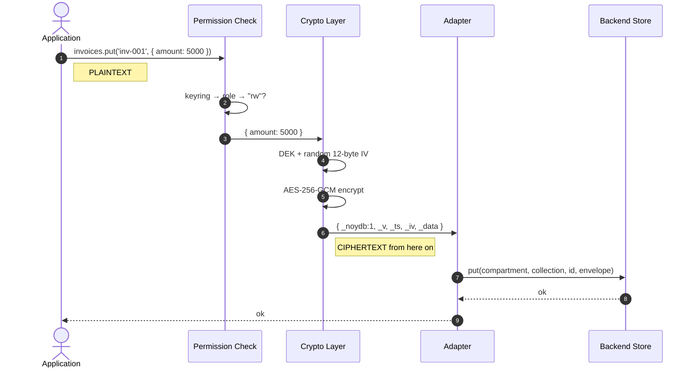
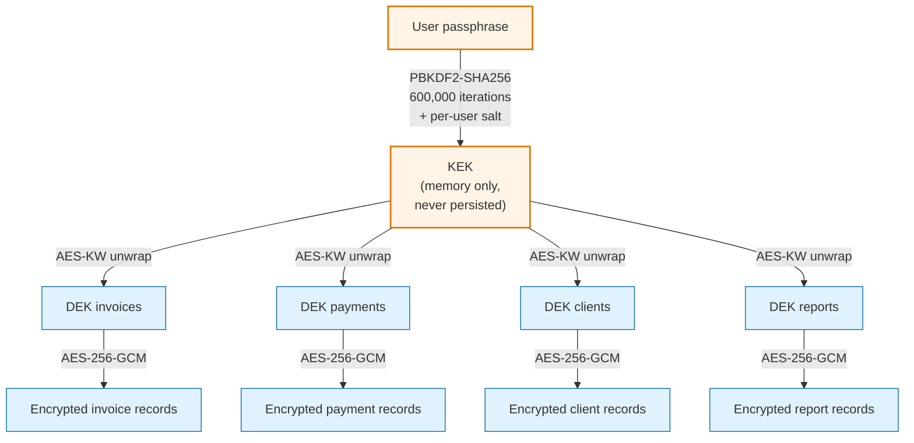
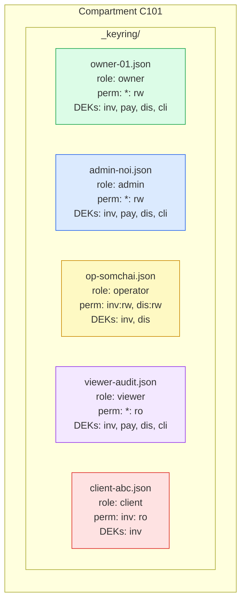
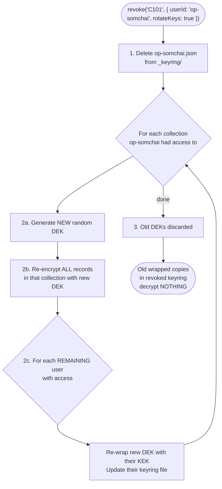
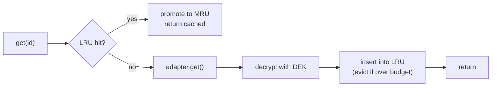
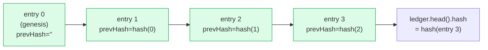
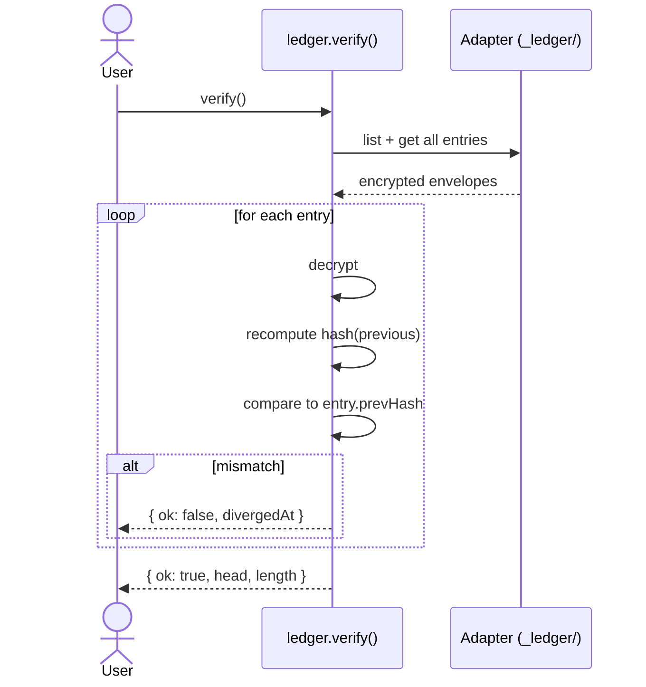
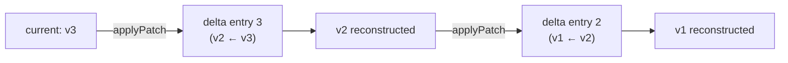

# Architecture

How NOYDB stores, encrypts, and protects your data.

> Related: [Roadmap](../ROADMAP.md) · [Deployment profiles](./deployment-profiles.md) · [Spec](../NOYDB_SPEC.md)

---

## Core ideas

| Idea                  | What it means                                                                                          |
|-----------------------|--------------------------------------------------------------------------------------------------------|
| Zero-knowledge        | Backends store ciphertext only. The server, the disk, the cloud — none of them ever see plaintext.   |
| Memory-first          | Eager hydration is the default (v0.2 behavior). As of v0.3, opt into lazy mode via `cache: {...}` for larger collections — see [Caching and lazy hydration](#caching-and-lazy-hydration). Target scale for eager mode: 1K–50K records. |
| Pluggable backends    | One 6-method adapter contract. Same API for USB, DynamoDB, S3, browser storage, or your own.          |
| Multi-user ACL        | 5 roles, per-collection permissions, portable keyrings. Revocation rotates keys.                       |
| Zero runtime crypto deps | Web Crypto API only. Never an npm crypto package.                                                   |

---

## Data flow — write path



The crypto layer is the **last** layer to see plaintext. Adapters never receive cleartext — they handle opaque envelopes.

---

## Key hierarchy



**Compromise model:**

| Compromised        | Effect                                          |
|--------------------|-------------------------------------------------|
| One DEK            | One collection exposed                          |
| KEK                | All collections exposed (this user)             |
| Passphrase         | KEK derivable → all collections (this user)     |

The passphrase is **never** stored. The KEK is **never** persisted. DEKs are stored only in *wrapped* form inside keyring files — useless without the KEK.

---

## Multi-user access model



**Permission matrix:**

| Operation | owner | admin    | operator | viewer | client  |
|-----------|:-----:|:--------:|:--------:|:------:|:-------:|
| read      | all   | all      | granted  | all    | granted |
| write     | all   | all      | granted  | —      | —       |
| grant     | all   | ↓ roles* | —        | —      | —       |
| revoke    | all   | ↓ roles* | —        | —      | —       |
| export    | yes   | yes      | granted  | yes    | granted |
| rotate    | yes   | yes      | —        | —      | —       |

`↓ roles*` (v0.5 #62) = admin can grant/revoke any role except `owner`, **including other admins**. The v0.4 rule of "admin can only grant operator/viewer/client" has been replaced with bounded delegation: a grant cannot widen access beyond what the grantor holds (`PrivilegeEscalationError`), and revoking an admin cascades to every admin they transitively granted (`cascade: 'strict'` default, `cascade: 'warn'` opt-in for diagnostic dry runs).

`export` (v0.5 #72) is ACL-scoped via `exportStream()`/`exportJSON()` — every role that can read collections can export what they can read. Operators and clients see only their explicitly-permitted collections.

---

## Key rotation on revoke

When a user is revoked with `rotateKeys: true`, every collection they had access to gets a fresh DEK. Their old wrapped DEKs become permanently useless.



---

## Encrypted record envelope

What every adapter actually stores:

```json
{
  "_noydb": 1,
  "_v": 3,
  "_ts": "2026-04-04T10:00:00.000Z",
  "_iv": "a3f2b8c1d4e5...",
  "_data": "U2FsdGVkX1+..."
}
```

| Field    | Encrypted? | Purpose                                                       |
|----------|:----------:|---------------------------------------------------------------|
| `_noydb` | no         | Format version (currently `1`)                                |
| `_v`     | no         | Record version for optimistic concurrency                     |
| `_ts`    | no         | ISO timestamp; lets the sync engine compare without keys      |
| `_iv`    | no         | 12-byte AES-GCM IV (random per encrypt; never reused)         |
| `_data`  | **yes**    | AES-256-GCM ciphertext of the record body                     |

`_v` and `_ts` are unencrypted by design — the sync engine needs to compare versions and timestamps without holding the encryption key.

---

## Caching and lazy hydration

As of v0.3, a `Collection` has two hydration modes:

**Eager (default, v0.2 behavior):** `openCompartment()` loads every record from the adapter, decrypts it, and keeps it in memory. `list()` and `query()` are `Array.filter` over the in-memory map. Indexes are allowed.

**Lazy:** triggered by passing `cache: { maxRecords, maxBytes }` at collection construction. Records are fetched on demand and cached in an LRU keyed by `(compartment, collection, id)`. Eviction is O(1) via a `Map` + delete/set promotion. On cache miss, `get(id)` hits the adapter, decrypts, and populates the LRU. `list()` and `query()` throw — use `scan()` (async iterator, bypasses the LRU) or `loadMore()` (via `listPage`, populates the LRU) instead. Declaring `indexes` is rejected at construction because indexes require full hydration to be correct.

`prefetch: true` restores eager behavior even when `cache` is set, which is useful for small compartments inside a larger lazy database.



The cache stores decrypted plaintext. It never leaves process memory and is cleared on `db.close()`.

---

## Pinia layering

The v0.3 Pinia integration sits *on top of* `Collection` without weakening the encryption boundary. A `defineNoydbStore` call produces a Pinia store whose reactive state is a view of the collection's in-memory map (eager mode) or LRU (lazy mode):

```mermaid
flowchart TB
    Component["Vue component"]
    Store["Pinia store<br/>(defineNoydbStore)"]
    Col["Collection&lt;T&gt;"]
    Crypto["Crypto layer<br/>(DEK + IV per record)"]
    Adapter["Adapter"]

    Component -->|items, query(), add(), remove()| Store
    Store -->|get/put/delete/scan| Col
    Col --> Crypto
    Crypto -->|ciphertext only| Adapter
```

The Pinia store never touches crypto directly — every operation goes through `Collection`, which means every invariant documented above (DEK per collection, fresh IV per encrypt, adapter sees only ciphertext) still holds. The only thing the store adds is Vue reactivity: mutations push into `items`, and live queries recompute via `ref`/`computed`.

SSR safety: the `@noy-db/nuxt` runtime plugin is registered with `mode: 'client'`, so the server bundle contains zero crypto symbols. During SSR, stores return empty reactive refs; the client hydrates after decrypt.

---

## Hash-chained ledger (v0.4+)

Every compartment owns an encrypted, append-only audit log stored in the internal `_ledger/` collection. Every `put` and `delete` appends one entry; entries are linked by `prevHash = sha256(canonicalJson(previousEntry))` so any modification breaks the chain at the modified position.



Each entry is stored as an encrypted envelope (same `EncryptedEnvelope` shape as data records, encrypted with a per-compartment ledger DEK). The plaintext payload is:

```ts
interface LedgerEntry {
  index: number          // sequential, 0-based
  prevHash: string       // hex sha256 of canonical JSON of previous entry
  op: 'put' | 'delete'   // v0.4 scope
  collection: string
  id: string
  version: number
  ts: string             // ISO timestamp
  actor: string          // user id
  payloadHash: string    // hex sha256 of the encrypted envelope's _data field
  deltaHash?: string     // optional — present for non-genesis puts (#44)
}
```

**Why hash the ciphertext, not the plaintext?** `payloadHash` is over the encrypted bytes, not the decrypted record. This means:

1. A user (or auditor) can verify the chain against the stored envelopes **without any decryption keys** — the adapter already holds only ciphertext, so hashing the ciphertext keeps the ledger at the same privacy level as the adapter.
2. The hash is deterministic per write because we always use a fresh IV — different writes of the same record produce different ciphertexts and different hashes.
3. Tamper detection works: if an attacker modifies a stored ciphertext to flip a record, the recomputed `payloadHash` no longer matches the ledger entry. The cross-check in `verifyBackupIntegrity()` catches it.

### Verification



`compartment.verifyBackupIntegrity()` runs both `ledger.verify()` AND a data envelope cross-check (recomputes `payloadHash` for every current record and compares to the latest matching ledger entry). This catches three independent attack surfaces: chain tampering, ciphertext substitution, and out-of-band writes that bypassed `Collection.put`.

### Delta history

Non-genesis puts also store a **reverse** JSON Patch in `_ledger_deltas/<paddedIndex>` that describes how to undo the put. Walking the chain backward applies these patches to reconstruct any historical version from the current state — storage scales with edit size, not record size.



Reverse patches were chosen over forward patches because the current state is already live in the data collection. Forward patches would need a base snapshot duplicating the data — reverse patches reuse what's already there.

### Single-writer assumption

The v0.4 ledger assumes a single writer per compartment. Two concurrent `append()` calls would race on the "read head, write head+1" cycle and could produce a broken chain. The single-writer model is fine for the current use cases (one Nuxt app per session, one CLI tool at a time) but multi-writer hardening is tracked for v0.5.

---

## Adapter interface

Every adapter implements exactly six async methods:

```ts
interface NoydbAdapter {
  name: string;

  get(compartment: string, collection: string, id: string)
    : Promise<EncryptedRecord | null>;

  put(compartment: string, collection: string, id: string,
      envelope: EncryptedRecord, expectedVersion?: number)
    : Promise<void>;

  delete(compartment: string, collection: string, id: string)
    : Promise<void>;

  list(compartment: string, collection: string)
    : Promise<EncryptedRecord[]>;

  loadAll(compartment: string)
    : Promise<CompartmentSnapshot>;

  saveAll(compartment: string, data: CompartmentSnapshot)
    : Promise<void>;

  // Optional extensions:
  ping?(): Promise<boolean>;                                    // v0.2
  listPage?(c, col, cursor?, limit?): Promise<PageResult>;      // v0.3
}
```

The contract is intentionally tiny. Building a custom adapter is `defineAdapter(opts => ({ name, get, put, delete, list, loadAll, saveAll }))` and you're done.

---

## Threat model (summary)

| Threat                          | Defense                                                                       |
|---------------------------------|-------------------------------------------------------------------------------|
| Disk/cloud breach               | Ciphertext only; no key material at rest                                      |
| Stolen keyring file             | Useless without the user's passphrase (PBKDF2 at 600K iterations)             |
| Tampering with stored records   | AES-GCM authentication tag fails on decrypt → throws                          |
| Tampering with the audit log    | (v0.4) hash-chain breaks on any modification; `verifyBackupIntegrity()` catches data envelope swaps too |
| Tampering with a backup file    | (v0.4) embedded `ledgerHead.hash` + post-load chain verification              |
| Bad data persisted by mistake   | (v0.4) Standard Schema v1 validation runs before encryption on `put()`        |
| Orphaned cross-collection refs  | (v0.4) `ref()` declarations enforce strict/warn/cascade per field             |
| Revoked user retains old copies | Key rotation makes their old wrapped DEKs decrypt nothing                     |
| IV reuse                        | Fresh 12-byte random IV per encrypt; never reused                             |
| Quantum (Grover's)              | AES-256 → 128-bit effective security; safe for the foreseeable future         |

What NOYDB **doesn't** defend against:
- Compromised client device with active session (KEK is in memory by definition)
- Malicious code with access to `crypto.subtle` in the same context
- Side-channel attacks against Web Crypto implementations

---

## Implementation history

- **Phase 0** — repo scaffold, tooling, CI matrix (Node 18/20/22)
- **Phase 0.5** — adapter conformance suite, simulation harnesses
- **Phase 1** — core + memory + file (single-user MVP)
- **Phase 2** — multi-user keyrings, grant/revoke/rotate
- **Phase 3** — sync engine + DynamoDB adapter
- **Phase 4** — browser adapter, WebAuthn, Vue composables, `withCache()` composition
- **Phase 5** — S3 adapter, migration utility, session timeout, CLI scaffolding, npm publish

Phases 0–5 shipped as v0.1 → v0.2.

- **v0.3** — Pinia-first DX. `@noy-db/nuxt` Nuxt 4 module, `@noy-db/pinia` (`defineNoydbStore` + `createNoydbPiniaPlugin`), reactive query DSL, secondary indexes, pagination via `listPage`, streaming `scan()`, lazy hydration + LRU.
- **v0.3.1** — `@noy-db/create` scaffolder + `noy-db` CLI.
- **v0.4** — Integrity & trust. Schema validation via Standard Schema v1, hash-chained ledger, delta history (RFC 6902 JSON Patch), foreign-key references via `ref()`, verifiable backups.

The forward roadmap continues in [`ROADMAP.md`](../ROADMAP.md).
