# Deployment profiles

NOYDB supports many topologies. Pick the one that matches your stack.

> Related: [Roadmap](../ROADMAP.md) · [Architecture](./architecture.md) · [Adapters](./adapters.md) · [Getting started](./getting-started.md)

---

## Quick selection

| Use case                     | core | file | dynamo | s3 | browser | vue |
|------------------------------|:----:|:----:|:------:|:--:|:-------:|:---:|
| USB / local disk             |  ✓   |  ✓   |        |    |         |     |
| Cloud only                   |  ✓   |      |   ✓    |    |         |     |
| Offline-first + cloud sync   |  ✓   |  ✓   |   ✓    |    |         |     |
| Browser SPA                  |  ✓   |      |        |    |    ✓    |     |
| Browser + cloud sync         |  ✓   |      |   ✓    |    |    ✓    |     |
| S3 archive                   |  ✓   |      |        | ✓  |         |     |
| Vue/Nuxt full stack          |  ✓   |  ✓   |   ✓    |    |         |  ✓  |
| Nuxt 4 + browser + sync (v0.3) | ✓ |      |   ✓    |    |    ✓    |  ✓  |
| Nuxt 4 + file (USB, v0.3)    |  ✓   |  ✓   |        |    |         |  ✓  |
| Testing / dev                |  ✓   |      |        |    |         |     |

---

## 1. USB stick (offline only)

```bash
npm install @noy-db/core @noy-db/file
```

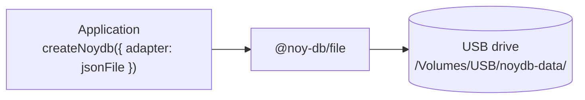

**Use case:** Accountant carries client data on USB between office and home.
**Pros:** Zero internet, fully portable, works anywhere.
**Cons:** Single device, no sync, USB loss = rely on backups.

---

## 2. Cloud only (DynamoDB)

```bash
npm install @noy-db/core @noy-db/dynamo
```

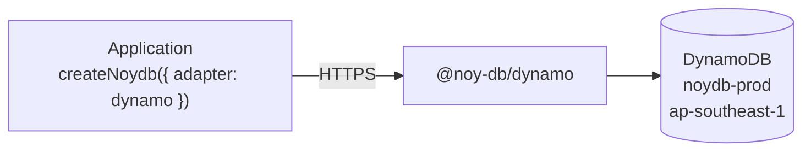

**Use case:** Cloud-native app with always-on connectivity.
**Pros:** Managed infra, multi-device.
**Cons:** Requires internet, AWS dependency.

---

## 3. Offline-first + cloud sync

```bash
npm install @noy-db/core @noy-db/file @noy-db/dynamo
```

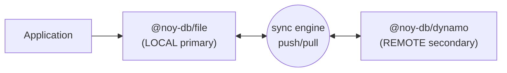

**Sync flow:**

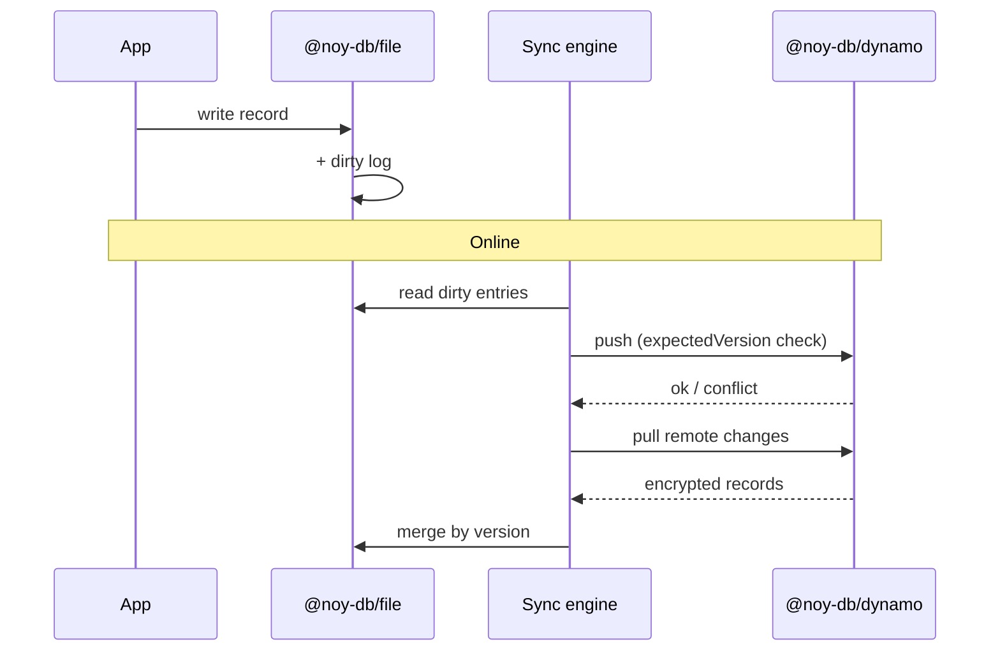

**Use case:** Regional accounting firm — USB at home, DynamoDB at office, auto-sync.
**Pros:** Best of both worlds, works offline, syncs when available.
**Cons:** Conflicts possible (mitigated by strategies).

---

## 4. Browser app with local cache

```bash
npm install @noy-db/core @noy-db/browser
```

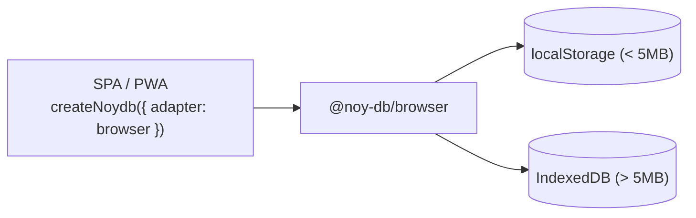

**Use case:** Personal finance app, offline PWA.
**Pros:** Zero server, instant load, works offline.
**Cons:** Browser storage limits, single device.

---

## 5. Browser + cloud sync

```bash
npm install @noy-db/core @noy-db/browser @noy-db/dynamo
```

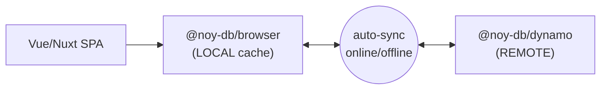

**Use case:** Multi-device web app with offline capability.
**Pros:** Instant hydration from cache, multi-device via cloud.
**Cons:** Browser storage limits for large datasets.

---

## 6. S3 archive

```bash
npm install @noy-db/core @noy-db/s3
```

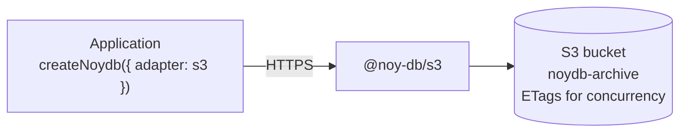

**Use case:** Long-term encrypted archival, bulk backup.
**Pros:** Cheapest storage, lifecycle policies, versioning.
**Cons:** Higher latency than DynamoDB; not ideal for frequent writes.

---

## 7. Vue / Nuxt full stack (production target)

```bash
npm install @noy-db/core @noy-db/file @noy-db/dynamo @noy-db/vue
# v0.3+: also @noy-db/pinia and @noy-db/nuxt
```

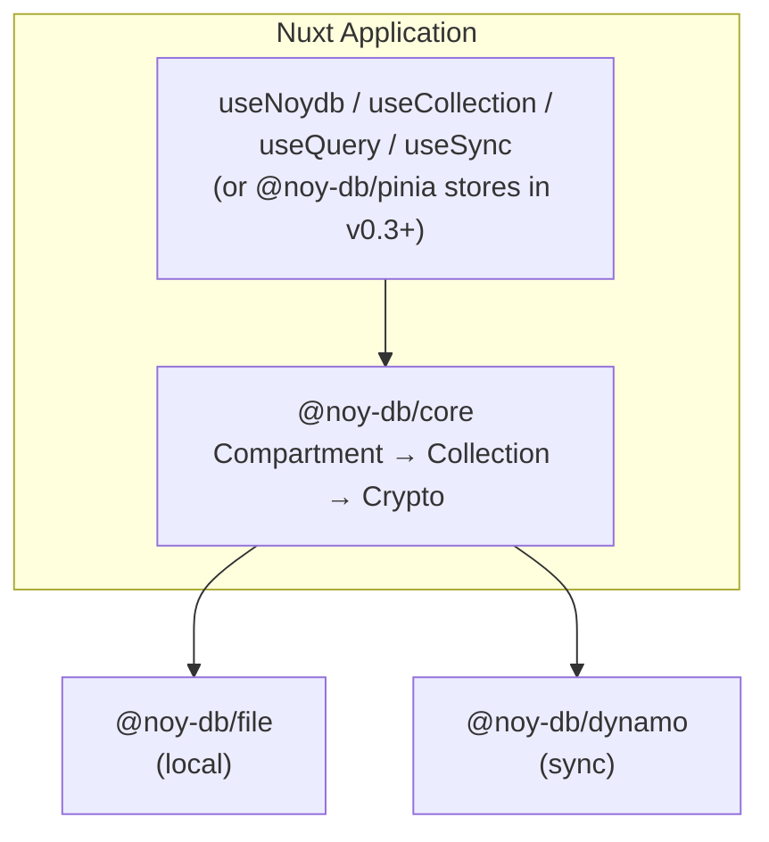

**Use case:** Regional accounting firm platform.
**Pros:** Reactive UI, type-safe, auto-sync, full offline support.
**Pinia integration (v0.3):** see profiles 7a and 7b below for the two v0.3 idiomatic Nuxt 4 topologies.

---

## 7a. Nuxt 4 + browser adapter + Dynamo sync (v0.3)

The default v0.3 web topology: store everything in the browser (localStorage / IndexedDB), sync to DynamoDB when online. Auto-imports + Pinia stores via `@noy-db/nuxt`. SSR-safe (client-only runtime plugin).

```bash
pnpm add @noy-db/nuxt @noy-db/pinia @noy-db/core @noy-db/browser @noy-db/dynamo @pinia/nuxt pinia
```

```ts
// nuxt.config.ts
export default defineNuxtConfig({
  modules: ['@pinia/nuxt', '@noy-db/nuxt'],
  noydb: {
    adapter: 'browser',
    sync: { adapter: 'dynamo', table: 'myapp-prod', mode: 'auto' },
    pinia: true,
    devtools: true,
  },
})
```

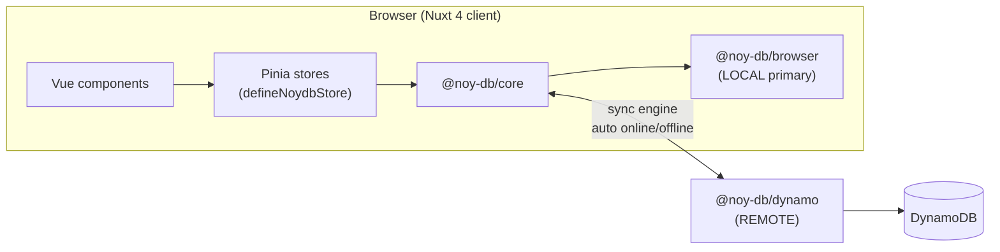

**Use case:** Multi-device web app for the accounting firm — staff log in from any browser, pick up where they left off, work offline at client sites.
**Pros:** Zero install on the client (PWA), instant cache hydration, multi-device via cloud, full reactivity through Pinia.
**Cons:** Browser storage limits (use lazy hydration + LRU for >50K records — see [Caching and lazy hydration](./architecture.md#caching-and-lazy-hydration)).
**SSR safety:** Module registers the runtime plugin with `mode: 'client'`. Server bundle has zero crypto symbols (CI-verified).

---

## 7b. Nuxt 4 + file adapter (USB workflow)

Same Nuxt 4 + Pinia DX, but the adapter is `@noy-db/file` writing to a USB stick or local directory. The Nuxt app runs locally (Electron, Tauri, or `nuxt preview` on a workstation) and the encrypted JSON files travel between sites on the USB.

```bash
pnpm add @noy-db/nuxt @noy-db/pinia @noy-db/core @noy-db/file @pinia/nuxt pinia
```

```ts
// nuxt.config.ts
export default defineNuxtConfig({
  modules: ['@pinia/nuxt', '@noy-db/nuxt'],
  noydb: {
    adapter: 'file',
    file: { dir: process.env['NOYDB_DATA_DIR'] ?? './data' },
    pinia: true,
  },
})
```

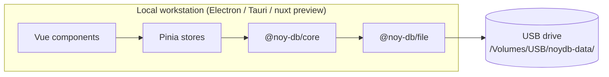

**Use case:** Accountant carries client compartments on a USB between home and office. Same code as profile 7a — only the adapter and the data location change.
**Pros:** Same Pinia DX as the cloud profile, but fully offline; auditable on-disk format; ideal for compliance scenarios where data must stay on-prem.
**Cons:** Single-writer (USB lock contention if multiple instances open the same compartment). Pair with profile 7a for hybrid offices.

---

## 8. Development / testing

```bash
npm install @noy-db/core @noy-db/memory
```

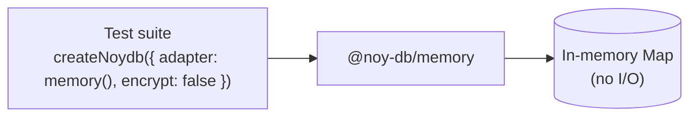

**Use case:** Unit tests, rapid prototyping, demos.
**Pros:** Zero setup, instant, deterministic. `encrypt: false` lets you inspect plaintext in tests.

---

## Mixing profiles

Adapters compose. For example, `withCache()` (v0.2+) turns any remote adapter into a cache-first adapter:

```ts
import { withCache } from '@noy-db/core';
import { browser } from '@noy-db/browser';
import { dynamo } from '@noy-db/dynamo';

const adapter = withCache(browser(), dynamo({ table: 'noydb-prod' }));
```

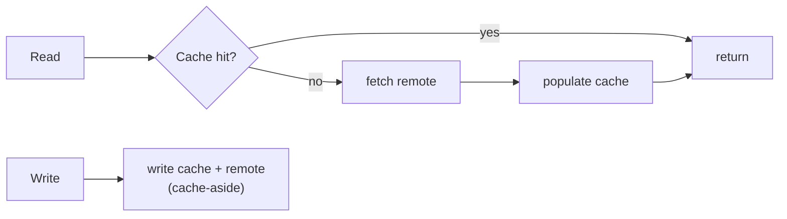

Custom compositions are easy: any function that takes adapters and returns an adapter is valid.
