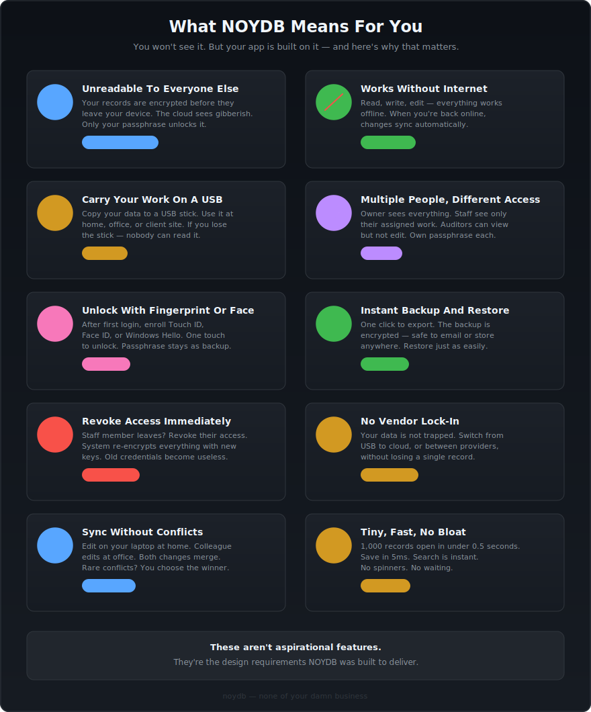

# What NOYDB Means For You

*You won't install NOYDB. You won't see it. But your app is built on it — and here's why that matters.*

<picture>
  
</picture>

---

### Your Data Is Unreadable To Everyone Else

Your records are scrambled with military-grade encryption before they leave your device. The cloud server storing your data? It sees gibberish. Someone finds your USB stick? Gibberish. Even the developer who built your app cannot read your data. Only your passphrase unlocks it.

### Works Without Internet

No Wi-Fi at the client site? No problem. Your app works fully offline — read, write, edit, everything. When you're back online, changes sync automatically. The internet is a convenience, not a requirement.

### Carry Your Work On A USB Stick

Copy your data folder to a USB stick. Plug it in at home, at the office, at a client site. It just works. The data on that stick is encrypted — if you lose it, nobody can read it.

### Multiple People, Different Access

The firm owner sees everything. The senior accountant can manage the team. Junior staff only see the companies they're assigned to. The external auditor can view but not edit. Each person has their own passphrase — no shared passwords.

### Unlock With Your Fingerprint Or Face

After your first login with a passphrase, you can enroll your fingerprint (Touch ID) or face (Face ID / Windows Hello). From then on — one touch to unlock. Your passphrase stays as a backup.

### Instant Backup And Restore

One click to export a full backup. The backup file is encrypted — safe to email, upload, or store anywhere. Restore from backup just as easily. Your monthly backup routine takes seconds.

### Fire Someone, Lock Them Out Immediately

When a staff member leaves, revoke their access. The system automatically re-encrypts everything they had access to with new keys. Even if they saved a copy of their credentials — useless. Locked out permanently.

### No Vendor Lock-In

Your data is not trapped in any cloud service. Switch from USB to cloud. Switch from AWS to a different provider. Move between storage backends without losing a single record. Your data format is open and documented.

### Sync Across Devices Without Conflicts

Edit an invoice on your laptop at home. Your colleague edits a payment at the office. When both devices sync — both changes merge cleanly. On the rare occasion two people edit the same record, the system detects it and lets you choose which version to keep.

### Tiny, Fast, No Bloat

Opens 1,000 records in under half a second. Saves a record in under 5 milliseconds. Searches are instant. No loading spinners. No waiting. Your app feels fast because the storage layer underneath is fast.

---

*These aren't aspirational features. They're the design requirements NOYDB was built to deliver.*
